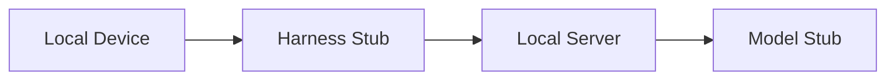

# Trestle

Trestle is a local-first scaffold for an educational programming system built from:

- an open-source model hosted behind a local server
- an open-source harness installed on a local device
- a minimal TypeScript monorepo intended to evolve through the RFC in [docs/rfc-001/README.md](./docs/rfc-001/README.md)

The current scaffold keeps the package behavior intentionally small. Both workspace packages expose an async `run` stub and can execute directly as scripts after build output is made executable.

## Packages

<!-- AUTO-GENERATED-CONTENT:START (SUBPACKAGELIST:verbose=true) -->

- [@trestle/harness](packages/harness) - Trestle harness executable scaffold
- [@trestle/model](packages/model) - Trestle model executable scaffold

<!-- AUTO-GENERATED-CONTENT:END -->

## Development

```sh
pnpm install
pnpm build
pnpm lint
pnpm test
pnpm typecheck
pnpm run docs
```

## Current Scope



- `packages/harness`: executable harness stub with an async `run`
- `packages/model`: executable model stub with an async `run`
- `docs/rfc-001/README.md`: RFC outline for the real harness/model design
