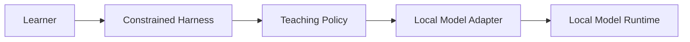

# roads-ai

Local-first workspace for an educational programming helper built from:

- an open-source model hosted on the learner's machine
- an open-source harness constrained to examples and explanations
- a policy layer designed to avoid direct answer delivery

The initial scaffold is intentionally infrastructure-heavy and product-light. It gives the repo a stable shape for package boundaries, docs generation, CI, and tests while the core behavior is still being designed in [docs/rfc-001.md](./docs/rfc-001.md).

## Packages

<!-- AUTO-GENERATED-CONTENT:START (WORKSPACE_PACKAGES) -->

- `@roads-ai/harness`: Teaching-oriented local harness stub for roads-ai
- `@roads-ai/model`: Local-only model adapter contract for roads-ai

<!-- AUTO-GENERATED-CONTENT:END -->

## Development

```sh
pnpm install
pnpm build
pnpm lint
pnpm test
pnpm typecheck
pnpm run docs
```

## Architecture Sketch



## Current Scope

- `packages/harness`: policy-aware orchestration stub
- `packages/model`: local model adapter stub
- `docs/rfc-001.md`: RFC outline for safety, architecture, and rollout decisions
