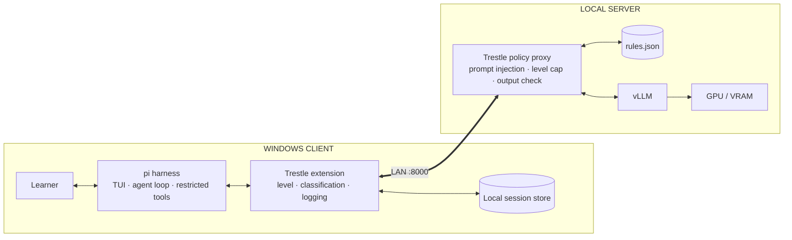
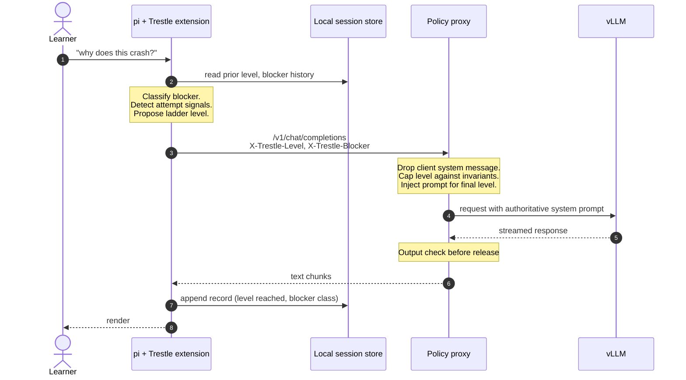
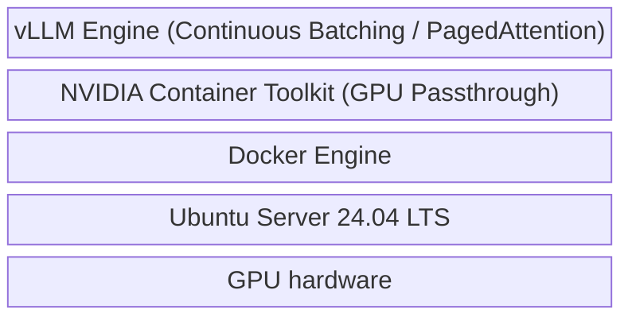
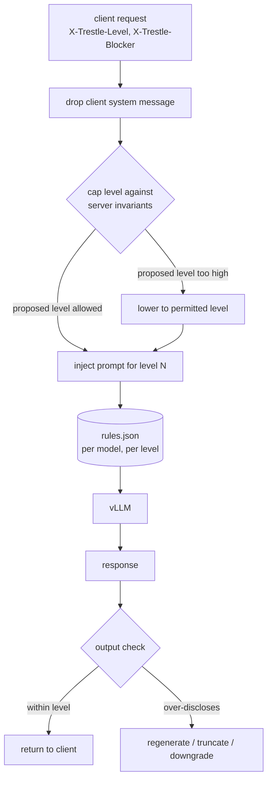
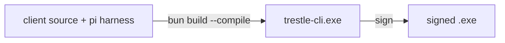

# RFC 001: Local-Only Trestle Teaching Harness

**Status:** Draft **Author:** Patrick Camacho

---

## 1. Summary

Trestle is a locally hosted AI assistant that keeps developers learning to program **unblocked when a senior engineer is not available**, without handing them code to paste in as their solution.

It pairs an open-source model served on the local network with a constrained Windows client. The harness is structurally prevented from editing files or reaching the internet, and the model is directed to release help progressively — enough to get the learner moving, not enough to remove the thinking.

The design separates two kinds of restriction, because they hold at different strengths:

|                                                                              | Enforced by  | Guarantee                    |
| ---------------------------------------------------------------------------- | ------------ | ---------------------------- |
| **Can't** — write files, reach the internet, run arbitrary commands          | Harness / OS | Hard. Structural.            |
| **Shouldn't** — hand over a complete solution before the learner has engaged | Model policy | Soft. A default, not a wall. |

The "can't" layer is what makes the copy-paste guarantee real: the assistant never types into the learner's editor, so any code that lands in their project was read, understood, and typed by them.

## 2. Problem Statement

Roads Technology develops engineers who are early in their programming careers. They learn by building small personal projects and by working closely supervised on small real-world problems.

Learning stalls when they hit a blocker and no senior engineer is around. The options available today are all bad:

- **Wait** for a mentor — progress stops, sometimes for hours or overnight.

- **Ask a general AI assistant** — it writes the solution. The learner ships code they cannot explain.

- **Struggle indefinitely** — which is only valuable up to a point, past which it becomes attrition.

The second option is not hypothetical harm. In a randomized trial of ~1,000 students, access to unrestricted GPT-4 during practice **degraded later unassisted performance by 17%** relative to no AI at all, even though it improved performance while the assistant was available.[^bastani] Learners who lean on an answer engine perform _better_ with it and _worse_ without it. That is the failure mode Trestle exists to avoid.

The goal is not to make help scarce. It is to keep the learner doing the cognitive work while still getting them moving.

Running the model locally also removes per-token cost as a limit on how much a learner can ask, and keeps proprietary and personal source code on the local network.

> **TODO:** Confirm with the stakeholder that "unblock when seniors are unavailable" is the primary success framing, versus "prevent copy-paste" as the primary framing. These lead to different products where they conflict.

## 3. Learner & Context Model

Everything in the design depends on who is using it, because the correct amount of help **inverts** as expertise grows.[^kalyuga]

### Primary learner

- Learning to program for the first time or with minimal professional experience.

- Working on **small personal projects** or **small, supervised real-world problems**.

- Has a mentor, but not always at the moment of need.

- Cannot reliably evaluate whether an explanation they are given is correct.

### What "stuck" looks like for this learner

Blockers are not uniform, and treating them uniformly is the central design error to avoid. Two examples that require opposite responses:

| Situation                       | Right response                 | Why                                                                                |
| ------------------------------- | ------------------------------ | ---------------------------------------------------------------------------------- |
| Used `.push()` on a Python list | **Tell them it's `.append()`** | Nothing is learned by struggling against an API name. This is incidental friction. |
| Loop skips the last element     | **Guide, don't solve**         | Bounds reasoning is the actual learning objective.                                 |

A single "never give the answer" rule gets the first case wrong every time, which is how a tool loses the learner's trust and sends them to a general assistant instead.

> **TODO:** Characterize the actual project surface — languages, frameworks, typical project size. This bounds the model capability requirement in §8.2 and the blocker taxonomy in §8.4.

## 4. Pedagogical Foundation

> This is the product. Everything else in this document is delivery.

### 4.1 What the evidence supports

The intuition "don't give them the answer" is directionally right about the _goal_ and wrong about the _mechanism_. The research converges on a conditional claim: withholding solutions helps when the learner has enough prior knowledge to make the struggle productive, and harms otherwise.

Findings that directly constrain this design:

- **Worked examples beat problem-solving for novices.** Replacing practice problems with studied worked examples produced higher learning gains; problem-solvers took ~6× longer with more errors.[^sweller] For a beginner, _showing_ the solved case is the evidence-backed move.

- **Guidance that helps novices harms experts, and vice versa** — effect reversals of d = 0.45–2.99 on identical instructional parameters.[^kalyuga] Any single fixed policy is guaranteed to mis-serve one end of a mixed cohort.

- **Productive failure does not cover this case.** It shows g = 0.36 for conceptual knowledge but **g = −0.03 for procedural knowledge**, and is _negative_ for less-prepared learners.[^sinha] Early programming is heavily procedural. Productive failure is also defined as failure _followed by consolidating instruction_ — the instruction phase is not optional.

- **Difficulty must be desirable, not merely difficult.** Expecting learners to generate an answer without the requisite background knowledge produces little learning and risks entrenching misconceptions.[^bjork]

- **Socratic-only hinting was tested on this exact population and lost.** An RCT with 178 CS1 students over two semesters compared targeted hints against Socratic hints: the Socratic group took more time, more attempts, and **committed more repeat errors**, with no compensating long-term gain.[^tell-or-ask]

The framing that fits is Koedinger & Aleven's **assistance dilemma**: too little help causes frustration and wasted time, too much causes shallow learning. It is a tradeoff to optimize per moment, not a constant to set once in a system prompt.[^koedinger]

### 4.2 What the validated designs actually do

| Design                       | Has the answer? | Reveal mechanism                                | Outcome                       |
| ---------------------------- | --------------- | ----------------------------------------------- | ----------------------------- |
| Plain ChatGPT[^bastani]      | yes             | immediately                                     | −17% unassisted               |
| Socratic hints[^tell-or-ask] | no              | never                                           | more errors, no gain          |
| Safeguarded tutor[^bastani]  | yes             | hint-first, teacher-authored solutions injected | harm eliminated               |
| Staged-reveal tutor[^kestin] | yes             | one step at a time, after an attempt            | **+30%, gains 2×, less time** |

**Every validated AI tutor possesses the answer and meters it. None refuse to have one.** The best measured result embeds a step-by-step solution and reveals it one step at a time after the learner attempts.[^kestin]

Trestle therefore adopts: **possess the solution, gate its release on demonstrated effort.**

### 4.3 The disclosure ladder

Help is released in levels. The learner's engagement, not a fixed rule, determines how far it goes.

```
L0  CLARIFY     "What did you expect to happen, and what happened?"
L1  ORIENT      Name the concept; point at the region. "This is a bounds
                issue, in the loop on line 12."
L2  EXPLAIN     Explain the mechanism concretely, in THEIR code.
L3  DEMONSTRATE Worked example on an analogous but different case.
L4  COMPLETE    Show the fix with one step blanked out (completion problem).
L5  RESOLVE     Show the fix; ask them to explain back why it works.
```

Two routing rules:

1. **Incidental blockers start at L5.** API names, syntax, tooling errors — answer them. No learning objective is served by withholding.

2. **Learning-objective blockers start low and advance on evidence of attempt.** Re-asking is not attempt; a described attempt, a prediction, or a modified try is.

This is guidance fading, the named solution to expertise reversal.[^renkl] It preserves the stakeholder constraint — the learner never receives a complete solution to paste as their first interaction — while removing the failure mode where the tool is useless to a beginner.

> **TODO:** Define what counts as "evidence of attempt" precisely enough to implement. Candidate signals: learner describes what they tried, makes a prediction, pastes a changed version, explicitly says they are stuck after N turns. This is the single most important unresolved detail in §4.

> **TODO:** Decide whether L5 is ever reachable in one session, or whether the ladder caps below it. Capping guarantees the constraint but reintroduces the abandonment risk.

> **TODO:** Decide whether the ladder resets per question, per session, or per topic.

### 4.4 What this does not solve

Both validated designs depend on **human-authored per-problem solutions and common-mistake lists**. Trestle's learners bring arbitrary code from personal projects — nobody is authoring reference solutions for a weekend side project.

This forces the model to derive the solution itself before deciding how much to reveal, which raises rather than lowers the capability bar (see §8.2). A model that meters a _wrong_ internal solution is worse than one that simply answers.

> **TODO:** This is an open research gap, not a solved problem. Decide whether to (a) accept the risk and mitigate via §8.7 uncertainty signaling, (b) restrict the MVP to a curriculum with authored solutions, or (c) pilot and measure before committing.

## 5. Constraints

Separating what is _given_ from what is _chosen_, because only the second is open for design debate.

### 5.1 Given (non-negotiable)

| Constraint                                                   | Source      |
| ------------------------------------------------------------ | ----------- |
| All components open source                                   | Stakeholder |
| Model hosted locally on the network; no third-party API      | Stakeholder |
| Client runs on Windows machines on the same network          | Stakeholder |
| Client is CLI or UI                                          | Stakeholder |
| Harness has no internet access beyond the local model server | Stakeholder |
| Must not hand over full solutions for copy-paste             | Stakeholder |
| Free at point of use (no per-token cost to learners)         | Stakeholder |

### 5.2 Chosen (open to revision with evidence)

- Disclosure is **graded**, not withheld absolutely (§4.3).

- Enforcement splits between a hard harness layer and a soft policy layer (§1).

- Sandboxing approach on Windows (§8.5) — **currently unresolved**.

- Inference engine, model, and quantization (§8.1, §8.2).

### 5.3 Accepted scope of influence

A learner can open a browser and ask a general assistant instead. This is accepted. The design assumes good-faith use and optimizes for **being the better option at the moment of need**, not for preventing bypass. A tool strict enough to be useless drives learners to exactly the unrestricted assistant that produces the −17% outcome.[^bastani]

This has a direct consequence for §11: adversarial hardening is not the priority. Being _good_ is.

## 6. Goals & Non-Goals

### Goals

- **Unblock without solving.** Learner resumes progress having done the reasoning.

- **Graded disclosure.** Help scales to the blocker and the learner's demonstrated effort.

- **No writes to learner code.** Structurally enforced; the learner types every line.

- **Local-only operation.** No WAN dependency; source code stays on the network.

- **Multi-session capacity.** Several learners served concurrently without queueing.

- **Windows-native, low-friction install.**

- **Auditable safety boundary.** Explicit enough to test.

- **Telemetry-capable from day one.** Aggregate topic reporting need not ship in MVP, but the architecture must not foreclose it (§9).

- **Honest about uncertainty.** The assistant says when it does not know (§8.7).

### Non-Goals

- Preventing a determined learner from using a different tool (§5.3).

- Proving prompt-only guardrails are sufficient on their own.

- IDE extension in the first milestone.

- User registration, authentication, or authorization.

- Grading, assessment, or performance evaluation of learners.

## 7. System Architecture



### Component responsibilities

What is inherited versus what is built:

| Concern                                   | Provided by | Our work                              |
| ----------------------------------------- | ----------- | ------------------------------------- |
| Terminal UI and rendering                 | pi          | none                                  |
| Agent loop and streaming                  | pi          | none                                  |
| Tool restriction                          | pi          | one config value — `tools: [read, …]` |
| Pointing at the model server              | pi          | one config value — `baseUrl`          |
| Serving and batching                      | vLLM        | deployment only                       |
| Ladder level, blocker class, telemetry    | —           | **pi extension**                      |
| Prompt injection, level cap, output check | —           | **policy proxy**                      |
| Per-model prompts and taxonomy            | —           | **rules.json**                        |

The build is three artifacts: an extension, a proxy, and a rules file. Everything else is configuration of components that already exist.

### Execution dataflow



## 8. Proposed System Specification

### 8.1 Model server & the API seam

**The architectural commitment is the OpenAI-compatible HTTP API, not any particular engine or model.** Everything above the seam — client, disclosure policy, blocker classification, evaluation — talks `/v1/chat/completions` and knows nothing else about what is serving it.

```
        client · policy proxy · evaluation harness
    ────────────────── /v1/chat/completions ──────────────────  ← the commitment
        vLLM (prod)   ·   Ollama / llama.cpp / MLX (dev)
        model A       ·   model B   ·   model C
```

This is deliberate. Model choice is an open question (§8.2) that should be settled by experiment rather than by architecture, and the field moves faster than this document. Swapping the model must be a configuration change, never a code change.

It also gives development on macOS for free: vLLM requires NVIDIA CUDA and cannot serve from an Apple Silicon machine, but a Mac-native engine speaking the same API can back the client during development.

**macOS development path.** `vllm-metal` (hosted under the vllm-project org, MLX-backed with prebuilt Metal kernels) runs vLLM natively on Apple Silicon. That collapses dev/prod parity from "two different servers" to "same server, different kernels and quantization" — same HF chat templates, same API surface, same flags.

> **TODO:** Verify `vllm-metal`'s `logprobs` support directly before committing. It is community-maintained and moving fast, and §8.7's uncertainty work depends on that endpoint behaving like the CUDA build. Fallback if it proves too immature: `llama.cpp`'s `llama-server`, which has the richest parameter coverage of the alternatives. Ollama is ruled out — it drops `logprobs` silently rather than erroring.

> **TODO:** Note that containerized GPU inference is impossible on macOS (see §17). The development server runs as a native host process, not in Docker.

**What swappability does _not_ buy.** The API is portable; behavior is not. Chat templates, sampling defaults, and instruction-following differ per model and per engine, and §8.3's disclosure policy is prompt-sensitive. A ladder tuned against one model may not hold against another.

Two consequences, both binding:

1. **Prompts are versioned per model.** §12's `rules.json` already carries a model identifier — that is the mechanism.
2. **The §13 evaluation suite is not a one-time gate; it is the regression test that makes swapping safe.** If a model can be changed by configuration, there must be a way to tell whether the change made teaching worse. This raises the priority of building the Tier 2 harness early.

> **TODO:** Prompt tuning and evaluation must run against the _production_ engine, not the development one. Define how that is enforced in practice, given the dev machine cannot run vLLM.

#### Production serving

Multiple learners must be served concurrently without a blocking queue, which rules out single-threaded serving.



1. **Ubuntu Server 24.04 LTS** — stable bare-metal PCI-e access and first-class NVIDIA kernel module support.

2. **NVIDIA Container Toolkit + Docker** — isolates the Python AI dependency stack from the host, maps GPU into the container with near-zero overhead.

3. **vLLM** — chosen as the production implementation of the seam. Ollama processes requests sequentially; vLLM implements continuous batching and PagedAttention, fragmenting the KV cache into non-contiguous pools so concurrent learners do not bottleneck VRAM linearly. This is an implementation choice, not an architectural one — it can be replaced without touching the client.

```yaml
services:
  trestle-inference-engine:
    image: vllm/vllm-openai:latest
    container_name: trestle-vllm-server
    environment:
      - NVIDIA_VISIBLE_DEVICES=all
    volumes:
      - ~/.cache/huggingface:/root/.cache/huggingface
    ports:
      - '8000:8000'
    ipc: host
    deploy:
      resources:
        reservations:
          devices:
            - driver: nvidia
              count: all
              capabilities: [gpu]
    command: >
      --model TBD
      --port 8000
      --max-model-len 8192
```

> **TODO:** Size the hardware against expected concurrency. How many simultaneous learners must be supported, and what is the acceptable time-to-first-token? This determines GPU selection and drives §16.

> **TODO:** Decide the failure posture when the server is unreachable — offline message, or degraded local fallback?

**The seam is already supported by the harness.** pi can be pointed at any OpenAI-compatible endpoint via `registerProvider({ baseUrl, api: "openai-completions", ... })`, or by overriding just the `baseUrl` of an existing provider. No fork or patch is needed to make the model swappable — it is configuration.

### 8.2 Model selection & capability bar

The teaching task is **harder** than the answering task. To operate the disclosure ladder the model must: solve the problem correctly, infer the learner's misconception, classify the blocker as incidental or objective, choose a ladder level, and stay at it without volunteering the rest.

A model that fails the first step meters a wrong answer confidently — the worst outcome in the system (§11 risk ①).

Because the engine sits behind a stable API seam (§8.1), model selection is an **experiment run against the evaluation harness**, not a commitment made in this document. The bar below is what a candidate must clear; which model clears it is decided by measurement.

> **TODO:** Survey current open-source coding models against this bar and pick one on evidence. Candidates must be re-derived at implementation time; the field moves faster than this document.

> **TODO:** Build a capability probe before committing: N real beginner blockers, scored on (a) is the diagnosis correct, (b) is the explanation correct, (c) did it hold its disclosure level. Correctness is the gate; instruction-following is second.

> **TODO:** Decide the quantization/size tradeoff. A larger, more capable model serving fewer concurrent learners may beat a fast, weak one — pedagogical quality is the product.

> **TODO:** Confirm license compatibility with the open-source constraint (§5.1) for whichever model is chosen — weights license, not just inference stack.

### 8.3 Disclosure policy engine

**Authority model: the client proposes, the server disposes.** Session state lives on the client (§8.6) for privacy, so the client is what tracks the ladder. But the client is also what a learner could modify, so the proxy treats the proposed level as a _request_ and enforces invariants it can check without knowing who the learner is.

|                                      | Level decided by           | Stored              | Client can skip the ladder? | Needs learner identity? |
| ------------------------------------ | -------------------------- | ------------------- | --------------------------- | ----------------------- |
| A — client authoritative             | extension                  | client              | yes                         | no                      |
| B — server authoritative             | proxy                      | server, per learner | no                          | **yes**                 |
| **C — client proposes, server caps** | extension, capped by proxy | client              | bounded                     | **no**                  |

**C is chosen.** B is the only true enforcement, but it requires per-learner identity on the server, which contradicts §6's no-registration non-goal and moves the telemetry privacy question (§9) from local-only into server-stored. Under the good-faith scope of §5.3, C closes the gap that actually matters — casually or accidentally skipping the ladder — without building identity infrastructure to stop someone who could open a browser instead.



Server-side invariants, checkable without identity:

- Never L4 or L5 on the first message of a thread.
- Advance at most one level per turn.
- A newly classified blocker starts at L0/L1 regardless of the level reached on the previous one.

Three mechanisms:

1. **Input control.** The proxy discards any client-supplied system message and injects the authoritative one for the final level. A modified client cannot escalate disclosure by editing a local file.
2. **Level capping.** The proposed level is bounded by the invariants above before any prompt is selected.
3. **Output check.** Input control alone would rest the entire policy on the model obeying a prompt. Since models fail to follow system prompts at a nonzero rate, a check runs on the response before it reaches the learner.

> **TODO:** Specify the output check. Options: heuristic (does the response contain a code block closely matching the learner's file?), a second model pass, or logprob-based. Must be cheap enough to run inline without wrecking latency.

> **TODO:** Decide behavior on a failed check — regenerate, truncate, or downgrade and warn. Regeneration doubles worst-case latency.

> **TODO:** Write the actual system prompt(s), one per ladder level. Deferred until §4.3's attempt-evidence definition settles.

### 8.4 Blocker classification

A single classification serves two consumers:

```
  learner asks ──► classify blocker
                        │
        ┌───────────────┴────────────────┐
        ▼                                ▼
  DISCLOSURE POLICY                 TELEMETRY (§9)
  incidental → answer (L5)          per-learner topic counts
  objective  → ladder from L0/L1    cohort curriculum signal
```

Starter taxonomy for early-career programmers — bounded and revisable:

`bounds/off-by-one` · `scope-and-closures` · `async-ordering` · `mutation-vs-copy` · `type-coercion` · `null-undefined` · `api-misuse` · `environment-tooling` · `syntax`

> **TODO:** Validate the taxonomy against real blockers rather than intuition. This is a strong argument for shipping the local session log (§9) in MVP even with no reporting UI — it produces the data that corrects this list.

> **TODO:** Decide where classification runs — a cheap pre-pass, a structured field in the main response, or a separate small model.

> **TODO:** Decide the incidental/objective split per category. `syntax` and `environment-tooling` are clearly incidental; `api-misuse` is genuinely ambiguous and may depend on whether the API is the learning objective.

### 8.5 Client harness & isolation (the "can't" layer)

The client wraps `@earendil-works/pi-coding-agent`, a mature open-source harness (MIT, ~6.1M downloads/month).

Guarantees this layer must provide:

| Guarantee                                 | Rationale                                              |
| ----------------------------------------- | ------------------------------------------------------ |
| No writes to the learner's workspace      | The copy-paste guarantee. Non-negotiable.              |
| No network egress except the model server | Source code stays on the network.                      |
| No arbitrary command execution            | The agent does not run things on the learner's behalf. |
| Reads only files the learner references   | No wholesale directory ingestion.                      |

#### Approach: capability restriction, not OS sandboxing

A single zero-install executable and OS-level sandboxing are mutually exclusive: real isolation lives in kernel features — containers, VMs, seccomp — which cannot be embedded in a userland binary. A client that requires Docker or WSL2 to be installed first is no longer low-friction (§6).

Given the good-faith scope in §5.3, the guarantees above are met instead by **not registering the capability in the harness**. An agent with no write tool does not write; it has no mechanism to.

| Guarantee                      | Via OS sandbox      | Via capability restriction        |
| ------------------------------ | ------------------- | --------------------------------- |
| No writes to workspace         | read-only mount     | no write/edit tool registered     |
| No egress except model server  | network policy      | no fetch tool; base URL pinned    |
| No arbitrary command execution | seccomp / allowlist | no bash tool registered           |
| Reads only referenced files    | mount scope         | client selects the files it sends |
| **Requires prior install**     | **yes**             | **no**                            |
| **Stops a malicious model**    | yes                 | no — out of scope per §5.3        |
| **Trust boundary**             | kernel              | harness library                   |

The trade is explicit: trust pi's tool registry rather than the kernel. Since §5.3 already concedes that a determined learner can simply open a browser, kernel-grade enforcement would be defending a boundary that is porous by design elsewhere.

**Confirmed supported.** pi builds its tool set from a swappable registry rather than hardcoding it into the agent loop, and filtering happens at session construction — the omitted tools are genuinely absent from the tool list the model receives, not denied at call time.

Three equivalent controls exist (`@earendil-works/pi-coding-agent@0.80.10`):

```typescript
// SDK — explicit allowlist
const { session } = await createAgentSession({
  sessionManager,
  modelRuntime,
  tools: ['read', 'grep', 'find', 'ls'], // no bash / edit / write
});
```

```bash
# CLI equivalent
pi --tools read,grep,find,ls
```

`createReadOnlyTools()` is also exported directly, and pi ships a `plan-mode` example extension that disables edit/write and filters bash through a read-only allowlist — a working reference for partial restriction.

Two details worth recording:

- **Defaults are unsafe for our purpose.** The default active built-ins are `read`, `bash`, `edit`, `write`. Restriction must be explicit; there is no safe-by-default posture to inherit.
- **`grep`, `find` and `ls` are off by default** and would need enabling if the client reads local files at all.

> **TODO:** Fix the exact tool list once the client form is decided (§12). A browser UI served from the server needs _no_ filesystem tools; a local client needs `read` plus some subset of `grep`/`find`/`ls`.

> **TODO:** Decide whether egress restriction needs any enforcement beyond a pinned base URL — e.g. a loopback proxy that refuses non-LAN destinations — as defence in depth against a misconfigured build.

**Fallback if the spike fails.** OS-level options, each reintroducing an install prerequisite:

- **Docker `sbx`** — GA, free for commercial use, standalone (no Docker Desktop), and runs on Windows, macOS and Linux. Strong on egress: deny-by-default with a host-side proxy, raw TCP/UDP/ICMP blocked outright. **Weak on execution**: the agent has full root inside the microVM with no syscall filtering, so the boundary is the hypervisor, not the process table — it contains blast radius rather than preventing execution. Note `--clone` fails Git ownership checks against a repo on a WSL filesystem, and SSH remotes are blocked by the non-HTTP protocol ban.
- **WSL2** — mature, free, built-in. Real kernel isolation; adds a two-filesystem mental model.
- **Microsoft MXC** — preview; OS-level policy enforcement, already used by Copilot CLI.
- **Windows Sandbox** — Pro/Enterprise only, ephemeral by design.

> **TODO:** Determine the Windows edition floor across learner machines — this eliminates some options outright.

### 8.6 Session state

Required by §4.3 — the ladder cannot advance on "demonstrated effort" without remembering what was demonstrated. A stateless client cannot implement the disclosure policy at all.

Minimum viable state, local to the client:

- Current thread: query, ladder level reached, blocker class, attempt signals observed.

- Historical: prior blocker classes and frequencies (feeds §9).

> **TODO:** Decide state lifetime and scope — per invocation, per project, per learner. Note §6 non-goals exclude user registration; a machine-local identifier satisfies this without becoming user management.

**Client-side only.** This keeps the server stateless, keeps learner data local (§9), and avoids per-learner identity on the server. The cost is that the client is the source of truth for the ladder — addressed by the capping model in §8.3, not by moving state to the server.

> **TODO:** Decide what happens to ladder state when a learner switches machines or clears their profile. Likely acceptable to simply restart at L0; note it rather than engineer around it.

### 8.7 Uncertainty & confidence

A beginner cannot evaluate whether an explanation is correct, which makes confidently-wrong instruction the highest-severity failure in the system (§11 risk ①).

Requirement: the assistant expresses uncertainty **as a teaching move**, not a UI badge —

> "I think this is a scope issue, but I'm not sure how your framework version handles it — here's how you can check."

This models what a senior actually sounds like and teaches verification, which is itself a skill the learner needs.

> **TODO:** Spike whether vLLM token logprobs are calibrated enough to gate on. They are exposed by the chosen stack and currently unused. Fallback: sample twice and flag disagreement.

> **TODO:** Decide which claim types always carry a verification pointer — version-specific behavior, library APIs, and anything the model could not verify against the learner's actual code are candidates.

## 9. Telemetry, Privacy & Data Ownership

**Decision:** the client writes a structured local interaction record from day one. Aggregate topic reporting is a fast-follow, not MVP, but the architecture must never foreclose it.

```
%AppData%/Trestle/sessions/<date>.jsonl
  { ts, learner_local_id, project_hash, blocker_class,
    ladder_level_reached, model_id, rules_version }
```

What this unlocks, in the order it becomes useful:

1. Attempt-gating for the disclosure ladder (§4.3) — same data.

2. A real evaluation set from actual beginner blockers (§13).

3. Aggregate topic reporting — "closures: 6 hits this month."

4. Cohort curriculum signal — eleven learners hitting async in one week is a lunch-and-learn, not eleven rescues.

5. Model-quality monitoring — the only way risk ① surfaces in the wild.

### Privacy position

A tool that records what you struggled with can be read as surveillance, and a learner who suspects that will stop asking honest questions.

**Default position:** learner-owned, local-only, opt-in to share. The learner brings their topic list to their mentor the way they would bring notes to a 1:1.

> **TODO — DECIDE EXPLICITLY:** Who can retrieve a given learner's topic list? Learner-only / learner-shares / mentor-on-demand. The third turns the tool into an evaluation instrument and changes learner behavior. This must be stated in the doc and disclosed to learners, not left to interpretation.

> **TODO:** Retention period, and whether a learner can delete their own history.

> **TODO:** Confirm no source code is written to the log — the schema above stores a project hash and blocker class deliberately. Verify the query field cannot leak code, or drop it.

## 10. User Stories

- **As a learner stuck,** I want to understand why my code crashes so I can fix it myself and explain it to my mentor tomorrow.

- **As a learner,** I want a quick answer to "what's the method called" without a Socratic dialogue, so I keep momentum on the part I'm actually learning.

- **As a mentor,** I want my junior to arrive with a specific question rather than a blank stare, so our limited time together is spent on the hard part.

- **As a mentor,** I want to know which concepts my team repeatedly struggles with, so I can teach the pattern once instead of debugging it eleven times.

- **As a team lead,** I want confidence that AI-generated code isn't silently entering our codebase.

- **As a security admin,** I want assurance that source code cannot reach an external API.

> **TODO:** Add a negative story — what a learner should _not_ be able to do — once §4.3's ladder cap is decided.

## 11. Risk Model

Scoped to good-faith users (§5.3). Adversarial bypass is explicitly out of scope, which puts pedagogical failure above security failure in this ranking.

| #   | Risk                                                                                                     | Severity    | Mitigation                                                                            | Status                              |
| --- | -------------------------------------------------------------------------------------------------------- | ----------- | ------------------------------------------------------------------------------------- | ----------------------------------- |
| ①   | **Model is confidently wrong**; learner cannot evaluate and internalizes a bad mental model              | **Highest** | Capability bar (§8.2); uncertainty signaling (§8.7); mentor loop as designed backstop | Partial — no mitigation is complete |
| ②   | **Dependency / illusion of competence** — learner passes tasks with the tool, cannot without it          | High        | Disclosure ladder (§4.3); no-write guarantee; §13 must measure unassisted performance | Unproven                            |
| ③   | **Tool is too strict → abandonment**, learner uses an unrestricted assistant and lands at −17%[^bastani] | High        | Incidental blockers answered directly (§4.3); usefulness treated as a safety property | Unproven                            |
| ④   | **Accidental source-code leakage** to an external service                                                | Medium      | Egress blocked to all but the model server (§8.5)                                     | Addressed by design                 |
| ⑤   | **Agent modifies learner code**                                                                          | Medium      | No-write guarantee (§8.5)                                                             | Addressed by design                 |
| ⑥   | **Telemetry perceived as surveillance** → dishonest usage                                                | Medium      | Learner-owned data position (§9)                                                      | Open decision                       |
| ⑦   | Prompt injection to escalate disclosure                                                                  | Low         | Server-side prompt injection (§8.3); low value given §5.3                             | Accepted                            |

> **TODO:** Risks ① and ② have no measurement plan. §13 must produce one or these remain assertions.

## 12. Build, Distribution & Update

### Client form

**Terminal (pi-tui) is the better-supported path.** `@earendil-works/pi-tui` is MIT-licensed, separately published, and carries no pi branding in its distributed code — a differential-rendering component TUI with synchronized output and bracketed paste, with Windows prebuilds for both x64 and arm64.

What it gives without a fork:

- **Rebranding is documented and code-free.** Setting `piConfig.name` and `piConfig.configDir` in `package.json` threads the app name through the banner, help text, terminal title, and process title. The startup logo is plain text, not ASCII art.
- **Extensions can inject UI.** `ctx.ui.setWidget()` places panels above or below the editor and accepts a full component factory; `ctx.ui.setStatus()` provides a persistent keyed indicator. That covers the ladder-level display and the uncertainty marker from §8.7.
- **`message_end` handlers can replace a finalized message** before render — a hook for the output check if any of it belongs client-side. Note interactive mode streams tokens live and re-renders at message end, so a rewritten message is briefly visible mid-stream.

Limits: interactive mode is **not** exported as a library — the SDK is headless — so a branded interactive TUI is built through extensions or a fork, not by embedding.

**Browser is entirely custom work.** pi has no web UI: no web framework anywhere in its tree, and RPC is stdio JSON-RPC. A browser client would be built from scratch against the SDK. It would eliminate client install, code signing, the AVX2 constraint, and the distribution problem, and would make the no-write guarantee absolute rather than configured — at the cost of the learner pasting code instead of referencing files.

> **TODO — BLOCKING for the terminal path:** pi's `docs/windows.md` states it requires a bash shell on Windows (Git Bash / Cygwin / MSYS2 / WSL). Verify whether that holds when the bash tool is omitted. If bash is required regardless, the terminal path carries a per-machine prerequisite and loses its friction advantage over a browser UI.

> **TODO:** Pin pi to an exact version. It shipped roughly 33 releases in ten weeks on `0.80.x`, and `CONTRIBUTING.md` states PRs from new contributors are auto-closed by default — treat upstream as read-only and expect to carry local patches.

Client compiled with **`bun build --compile`** into `trestle-cli.exe`.



The decisive evidence is that **pi already does exactly this**. Its own release pipeline runs `bun build --compile` and cross-compiles all six targets — including `--target=bun-windows-x64` — from a single Linux CI runner, and it ships a Bun-specific entrypoint alongside the Node one. Bun is a first-class supported runtime for the harness, not an experiment.

Two properties that matter here:

- **Cross-compilation works.** Windows executables can be built from macOS or Linux with no Windows machine in the loop. Node SEA cannot cross-compile at all and would force a Windows runner.
- **No node-gyp in the dependency tree.** The native surfaces are prebuilt N-API modules and a WASM blob.

Known constraints, all requiring a decision:

| Constraint                                                                                                             | Impact                                          |
| ---------------------------------------------------------------------------------------------------------------------- | ----------------------------------------------- |
| Upstream ships a **zip, not a bare `.exe`** — WASM blob, themes and an optional clipboard module sit beside the binary | Defines what "single executable" means for us   |
| Windows Defender flags unsigned Bun-compiled binaries                                                                  | Budget for a signing certificate                |
| `bun-windows-x64` requires **AVX2**                                                                                    | Pre-2013 CPUs need a baseline variant — see §19 |
| ~45 MB compressed / ~100 MB installed                                                                                  | Distribution sizing                             |

> **TODO — DECIDE:** Does "single, low-friction executable" (§6) mean one _file_ or one _archive_? One file requires embedding the WASM and theme assets and likely dropping optional clipboard support. One archive is upstream's own answer and costs nothing.

> **TODO:** Validate before committing — clone `earendil-works/pi` and run its binary build for `windows-x64` from macOS. This reproduces the known-good path in a single command.

> **TODO:** Confirm `jiti`-based dynamic config loading survives compilation. Bun does not bundle dynamically-required modules, so anything resolved at runtime needs an explicit smoke test in the compiled binary.

### Dynamic rules

Prompts and policy change more often than binaries, so the client fetches them at start:

1. Client requests `http://SERVER:8000/rules.json` at boot.

2. Updates local cache on success.

3. Falls back to the compiled-in baseline when offline.

> **TODO:** Define the `rules.json` schema — version, model id, per-ladder-level prompts, blocker taxonomy, incidental/objective mapping. The model identifier is load-bearing: §8.1 makes the model swappable, and prompts are tuned per model, so the rules payload is what keeps a model swap from silently changing teaching behavior.

> **TODO:** Decide whether a client may run with stale rules indefinitely, or hard-fails after N days. Relevant if a policy fix must reach every learner.

> **TODO:** Client distribution and update mechanism for Windows machines. Options: shared network path, MDM/Intune, manual install. Depends on how learner machines are managed.

## 13. Evaluation Plan

Format-shaped metrics — text-similarity against the learner's file, prose-to-code ratio, a regex for a trailing question mark — measure **compliance, not learning**, and are deliberately excluded. A response can score perfectly on all of them while teaching nothing:

> _"Consider the relationship between a collection's cardinality and the bounds of your iteration construct. What is the highest valid index for a collection of size N?"_

Low similarity, high prose, ends in a question — and useless to a beginner. Those metrics are removed.

### What to measure instead

**Tier 1 — does the learner learn?** (the only thing that matters)

- **Unassisted performance.** Can the learner solve a comparable problem without the tool? This is the metric that caught the −17% effect and the only one that detects risk ②.

- **Explanation quality.** Can they explain the fix afterward? Directly matches the mentor-continuity goal.

**Tier 2 — is the tool behaving?**

- Correctness of diagnosis on a curated blocker set (risk ①).

- Ladder discipline: did it hold its level, and did it correctly route incidental blockers to a direct answer?

**Tier 3 — is it being used?**

- Retention and abandonment (risk ③). A learner who stops using it has told you something.

- Time-to-unblock.

> **TODO — SIGNIFICANT:** Tier 1 requires a study design, not a script. Pre/post comparison? Held-out problems? Who administers it? This is the largest unresolved piece of work in the RFC and it cannot be automated away.

> **TODO:** Build the curated blocker set for Tier 2 — real beginner blockers with known-correct diagnoses. §9's session log is the natural source once it exists.

> **TODO:** Define the ship gate. What result would stop rollout?

## 14. Rollout & Adoption

> **TODO:** Entire section. Adoption is a live risk (③), not an afterthought.

Questions to resolve: how learners are introduced to the tool; whether use is expected or optional; how mentors are briefed on their role in the loop; what the first-week experience is; how feedback returns to the design.

## 15. Milestones

> **TODO:** Entire section. The RFC describes an end state with no phasing, which makes it impossible to schedule or descope.

Rough shape to react to:

| Phase                | Contains                                                             | Exit criterion                           |
| -------------------- | -------------------------------------------------------------------- | ---------------------------------------- |
| 0 — Spike            | Model capability probe (§8.2); Windows sandbox decision (§8.5)       | Both resolved with evidence              |
| 1 — Walking skeleton | Server + CLI + fixed-level prompt + no-write guarantee + session log | One learner unblocked end-to-end         |
| 2 — Pedagogy         | Disclosure ladder, blocker classification, output check              | Ladder discipline measurable (Tier 2)    |
| 3 — Evidence         | Uncertainty signaling, evaluation study                              | Tier 1 result exists                     |
| 4 — Amplification    | Aggregate topic reporting, mentor surfacing                          | Mentors report it changes their teaching |

## 16. Cost Model

> **TODO:** Entire section. §2 claims local hosting eliminates recurring cost; the claim is unquantified and should be verified rather than assumed.
>
> Must account for: GPU hardware capital, power draw, hosting/maintenance labor, and the counterfactual cost of an equivalent hosted API at realistic volume. For a small cohort, self-hosting may be more expensive in total — the constraint is given regardless (§5.1), but the _justification_ in §2 should be accurate.
>
> Also worth stating: the real benefits may be **unmetered usage** (learners never ration questions) and **data locality**, rather than raw cost.

## 17. Alternatives Considered

> **TODO:** Complete this section. Standard RFC hygiene.

Already rejected, with reasons:

| Alternative                                            | Rejected because                                                                                                                                                                                                     |
| ------------------------------------------------------ | -------------------------------------------------------------------------------------------------------------------------------------------------------------------------------------------------------------------- |
| Ollama instead of vLLM                                 | Sequential request handling; concurrent learners would queue. Also **silently drops `logprobs`** rather than erroring, which would make §8.7's uncertainty work fail invisibly in dev and behave differently in prod |
| Gondolin microVM + `pi-secure-it` for client isolation | Both Linux/macOS only — no Windows support, which §5.1 requires. `pi-secure-it` is additionally a single-maintainer package with ~116 monthly downloads, unsuitable as a security boundary                           |
| Hosted API with a teaching wrapper                     | Excluded by §5.1 (local-only, open source)                                                                                                                                                                           |
| Refuse-all-solutions policy                            | Contradicted by the evidence in §4.1–4.2                                                                                                                                                                             |
| Node.js SEA for client packaging                       | Stability 1.1, and cannot cross-compile — would force a Windows CI runner. Bun is already the harness's own build path (§12)                                                                                         |
| OS-level sandboxing as the primary isolation           | Cannot be bundled into a zero-install executable, and unnecessary under the good-faith scope in §5.3. Retained as fallback (§8.5)                                                                                    |
| Committing to one model/engine up front                | Model choice is best settled by measurement; the API seam (§8.1) defers it to configuration                                                                                                                          |
| Containerized GPU inference on macOS for development   | Impossible — Apple GPUs sit behind no IOMMU and cannot be passed into a VM guest. Confirmed by Apple's own container maintainers, not a Docker limitation                                                            |

Still to document: prompt-only enforcement with no harness restriction; an IDE extension instead of a CLI; buying an existing product (CS50-style duck, Khanmigo) rather than building.

## 18. References

### Learning science

- [^sweller]: Sweller & Cooper (1985), _Cognition and Instruction_ 2(1), 59–89 — worked example effect. [https://en.wikipedia.org/wiki/Worked-example_effect](https://en.wikipedia.org/wiki/Worked-example_effect)
- [^kalyuga]: Kalyuga (2007), _Educational Psychology Review_ — expertise reversal effect. See also the 2025 meta-analysis in _Learning and Instruction_: [https://www.sciencedirect.com/science/article/pii/S0959475225000660](https://www.sciencedirect.com/science/article/pii/S0959475225000660)
- [^sinha]: Sinha & Kapur (2021), _Review of Educational Research_ — productive failure meta-analysis. [https://journals.sagepub.com/doi/full/10.3102/00346543211019105](https://journals.sagepub.com/doi/full/10.3102/00346543211019105)
- [^bjork]: Bjork & Bjork (2011) — desirable difficulties, and the caveat that difficulty must be desirable. [https://www.unh.edu/teaching-learning-resource-hub/sites/default/files/media/2023-06/itow-introducing-desirable-difficulties-into-practice-and-instruction-bjork-and-bjork.pdf](https://www.unh.edu/teaching-learning-resource-hub/sites/default/files/media/2023-06/itow-introducing-desirable-difficulties-into-practice-and-instruction-bjork-and-bjork.pdf)
- [^koedinger]: Koedinger & Aleven (2007) — the assistance dilemma. [https://pact.cs.cmu.edu/pubs/Koedinger%20Aleven%2007.pdf](https://pact.cs.cmu.edu/pubs/Koedinger%20Aleven%2007.pdf)
- [^renkl]: Renkl, Atkinson & Maier (2000) — guidance fading. [https://link.springer.com/chapter/10.1007/978-1-4419-8126-4_13](https://link.springer.com/chapter/10.1007/978-1-4419-8126-4_13)

### AI tutoring evidence

- [^bastani]: Bastani et al. (2025), _PNAS_ — RCT, ~1,000 students; unrestricted GPT-4 degraded unassisted performance 17%. [https://www.pnas.org/doi/10.1073/pnas.2422633122](https://www.pnas.org/doi/10.1073/pnas.2422633122)
- [^kestin]: Kestin et al. (2025), _Scientific Reports_ — Harvard PS2 AI tutor; staged reveal after attempt, learning gains >2× active learning. [https://www.nature.com/articles/s41598-025-97652-6](https://www.nature.com/articles/s41598-025-97652-6)
- [^tell-or-ask]: "To Tell or to Ask?", SIGCSE TS 2026 — RCT, 178 CS1 students; Socratic hints produced more repeat errors with no long-term gain. [https://dl.acm.org/doi/10.1145/3770761.3777327](https://dl.acm.org/doi/10.1145/3770761.3777327)

### Technology

- pi coding agent — [https://github.com/earendil-works/pi](https://github.com/earendil-works/pi) · [https://www.npmjs.com/package/@earendil-works/pi-coding-agent](https://www.npmjs.com/package/@earendil-works/pi-coding-agent)
- vLLM — [https://docs.vllm.ai](https://docs.vllm.ai)
- Node.js SEA — [https://nodejs.org/api/single-executable-applications.html](https://nodejs.org/api/single-executable-applications.html)
- Microsoft MXC — [https://github.com/microsoft/mxc](https://github.com/microsoft/mxc)
- Windows platform security for AI agents — [https://blogs.windows.com/windowsdeveloper/2026/06/02/windows-platform-security-for-ai-agents/](https://blogs.windows.com/windowsdeveloper/2026/06/02/windows-platform-security-for-ai-agents/)

## 19. Open Questions

### Blocking — cannot build without these

1. **What counts as "evidence of attempt"?** (§4.3) The disclosure ladder advances on demonstrated effort, and nothing is implementable until this is defined. Resolved by: writing 10–15 real interaction transcripts by hand and marking where the level should advance.
2. ~~**Which Windows sandbox?**~~ **Resolved** (§8.5) — no OS sandbox required. pi supports omitting built-in tools entirely, which delivers the §8.5 guarantees with no install prerequisite. OS-level isolation is retained only as a documented fallback.
3. **Which model, and does it clear the capability bar?** (§8.2) Everything pedagogical assumes the model can diagnose correctly before deciding what to reveal. Resolved by: the §8.2 capability probe on real beginner blockers.

### High-impact — shape the product

4. **Does the ladder ever reach L5 (full solution)?** (§4.3) Capping guarantees the stakeholder constraint but raises abandonment risk (③). Ties directly to how "shouldn't" is interpreted.
5. **Who can see a learner's topic list?** (§9) Learner-only, learner-shares, or mentor-on-demand. Changes whether the tool is trusted infrastructure or an evaluation instrument.
6. **How is Tier 1 learning actually measured?** (§13) Requires a study design and a person to run it. Without it, the central claim stays unfalsifiable.
7. **How does the system degrade when the model is weak or ambiguous?** Say "I don't know" and route to the mentor? Escalate the ladder? Currently undefined.
8. **What happens when the learner disagrees with the assistant?** A beginner cannot adjudicate. Is there a "flag this" path that reaches a human?

### Deferred — needed before rollout, not before build

9. **Client distribution and update on managed Windows machines.** (§12)
10. **Do learner machines support AVX2?** (§12) `bun-windows-x64` requires it; pre-2013 CPUs would need a separate baseline build. Resolved by: checking CPU models across the actual machines. Moot if the client ships as a browser UI (§19 Q4a).
11. **Code signing has no budget.** (§12) Unsigned executables trigger Windows Defender/SmartScreen warnings on first run. Options: accept the warning and document the click-through, distribute via a trusted internal path, or avoid shipping an executable at all (§19 Q4a). Certificates cost money that does not currently exist.
12. **What does the mentor actually do with surfaced topics?** (§9) The feature has no value if nobody acts on it.
13. **Onboarding and expectation-setting.** (§14) If learners expect ChatGPT, the first session sets up disappointment.
14. **Does the cost justification in §2 survive arithmetic?** (§16) The constraint holds regardless; the reasoning should be honest.
15. **Multi-language support.** Does the blocker taxonomy (§8.4) generalize across the languages learners actually use?
16. **Future risk — adoption beyond beginners.** (§3) The disclosure ladder is calibrated for beginners only. If mid-level engineers pick the tool up, expertise reversal makes that fixed calibration actively harmful to them. Not a question to answer now — a condition to watch for, and a trigger to revisit §3 and §4.3 if it happens.
