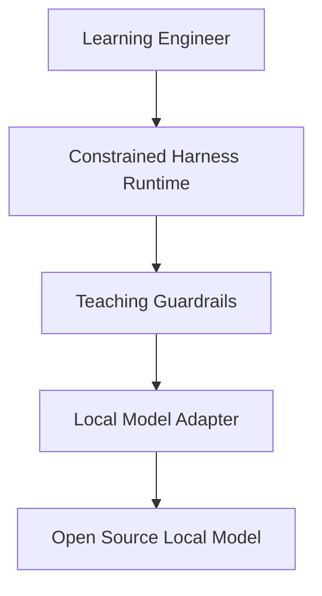

# RFC-001: Local-Only Teaching AI

Status: Draft

## Summary

Define a local-first architecture that combines an open-source model running on the local network with an open-source harness while enforcing a teaching-oriented response policy: the system may explain concepts, show worked examples, and ask guiding questions, but it must not provide direct solutions for the learner to copy.

## Problem

Roads Technology exists toEngineers learning to program often want immediate feedback without outsourcing all thinking to a hosted assistant. Existing tools tend to optimize for answer completion, broad tool access, and convenience rather than deliberate learning constraints.

## Goals

- Run entirely on local hardware except for calls to the local model endpoint.
- Prevent internet access beyond the local model connection.
- Prevent local filesystem access for the harness runtime.
- Bias responses toward explanations, worked examples, hints, and questions.
- Make the safety boundary explicit enough to test and audit.

## Non-Goals

- Proving that prompt-only guardrails are sufficient on their own.
- Solving model hosting, model choice, or hardware sizing in this RFC.
- Shipping a production-grade IDE extension in the first milestone.

## Proposed System

## Key Design Questions

1. What counts as a direct answer versus a teaching example?
2. Which enforcement layers belong in prompts, runtime wrappers, evaluators, and UX?
3. How should the system degrade when the local model is weak or ambiguous?
4. What evaluation set proves the assistant is helping without over-solving?

## Sections To Fill

- User stories
- Threat model and abuse cases
- Safety architecture
- Harness and model selection criteria
- Interaction design
- Evaluation plan
- Open questions

## References

- pnpm workspace docs: https://pnpm.io/workspaces
- Changesets GitHub Action: https://github.com/changesets/action
- Vitest docs: https://vitest.dev/
