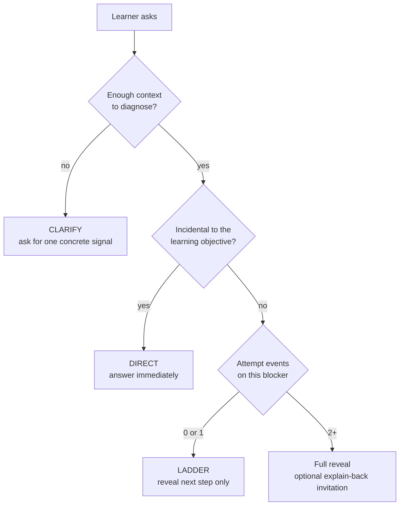
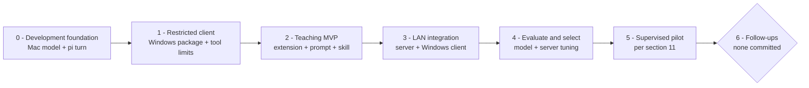
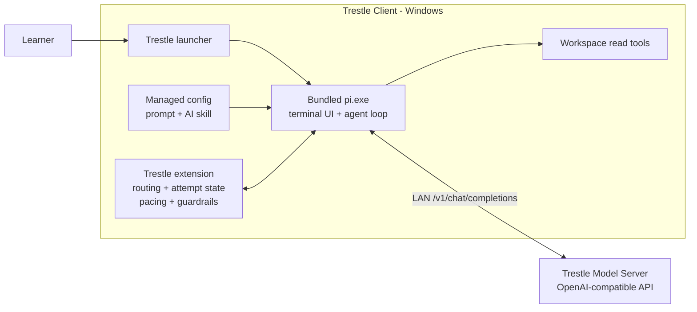
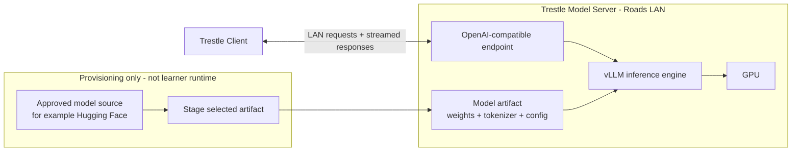

# RFC 001: Local-Only Trestle Teaching Harness

**Status:** Draft v2

**Author:** Patrick Camacho

> This is the decision document. Reproduction details and worked examples live in the linked companion documents.

---

## Part A - Decision Context

### 1. Summary

Trestle keeps developers **unblocked when a senior engineer is unavailable** without immediately handing them a solution.

**Current status:** RFC under review; milestone 0 is in progress. The resource/endpoint spike is complete, the next gate is one real pi-to-model turn, and there are no active blockers. Proposed open work is in [§6](#6-decision-status--open-work); delivery gates are in [§12](#12-delivery-milestones-and-implementation-sequence).

The MVP is a pinned open-source coding-agent CLI (pi), a fixed teaching prompt, one adapted community skill, a Roads-managed LAN vLLM inference server, and one bespoke runtime component: a thin extension that owns attempt state, pacing instructions, status, and capability guardrails. vLLM-Metal runs natively only for development on the MacBook; learners use the Ubuntu Trestle Model Server over the Roads LAN, running a pinned official vLLM OpenAI Docker image. Both serve the same OpenAI-compatible endpoint. Policy servers, output checking, and telemetry are deferred and require pilot evidence ([§12](#12-delivery-milestones-and-implementation-sequence)).

**Terminology:** in this RFC, **local-only** names the deployment boundary: model inference is Roads-hosted and no WAN model provider or tool path is configured at launch. It does not claim host-level network isolation; stock learner-triggered residuals are disclosed in §15. The model is the neural network that generates responses. Pi is the **harness**: it owns the conversation loop, tools, state, and interface. When pi connects the model to those tools, the running combination behaves as an **agent**; Trestle constrains that agent by configuring the harness.

Two kinds of restriction, held at different strengths:

|                                                                                                        | Enforced by                | Guarantee                                                                                                                                     |
| ------------------------------------------------------------------------------------------------------ | -------------------------- | --------------------------------------------------------------------------------------------------------------------------------------------- |
| **Can't** - the model has no write/execute tools and no configured WAN provider or tool path at launch | Harness config + extension | Hard for good-faith use; learner-triggered built-ins are disclosed residuals ([§15](#15-mvp-architecture-locked-down-pi--one-thin-extension)) |
| **Shouldn't** - hand over a solution before the learner has engaged                                    | Model policy               | Soft. A default, not a wall.                                                                                                                  |

The hard layer removes model write/execute tools and confines reads to the workspace selected at launch. The design assumes good-faith learners and a Roads-managed LAN: it prevents accidents and drift, not determined bypass. Stock pi still exposes learner-invoked WAN commands, so the accepted MVP guarantee is scoped to no configured model WAN provider or tool path at launch ([§15](#15-mvp-architecture-locked-down-pi--one-thin-extension)).

### 2. Problem

Roads develops engineers through projects and supervised work. When no mentor is available, they must wait, use an answer-oriented assistant, or struggle past the point where effort remains productive.

A randomized trial of nearly 1,000 high-school math students found that unfettered GPT-4 improved assisted practice but reduced later unassisted exam scores by 17% versus no AI ([E01](./evidence-ledger.md#e01)). Transfer to novice programming is a pilot hypothesis, not an established fact.

### 3. Scope & Assumptions

**Learner and use context:**

- Programmers or developers with minimal professional experience.

- Working on small projects, with a mentor who is temporarily unavailable.

**Assumption to validate:** learners cannot reliably judge whether an explanation is correct ([§13](#13-risks)); the pilot tests this with the actual cohort.

**Example: incidental API friction**

```js
const names = ['Ada'];
names.append('Lin');
```

Desired first response:

> JavaScript arrays use `.push()`, so write `names.push("Lin")`. `.append()` is not an Array method.

The learner's objective is not API-name recall, so Trestle answers directly.

**Example: conceptual bounds error**

```js
for (let index = 0; index < items.length - 1; index++) {
  render(items[index]);
}
```

Desired first response:

> If `items.length` is 3, which index values does this loop visit? Compare those with the indexes you expect it to render.

Bounds reasoning is the learning objective, so Trestle guides without giving the fix.

Whether a blocker is incidental is relative to the current learning objective. A fixed "never answer" rule gets this distinction wrong.

**Provisional MVP surface:** web development, using JavaScript/TypeScript, Node.js, HTML/CSS, PHP, and WebGL as the working language/technology set. A Roads leader should confirm the actual frameworks and typical project sizes before check 1 is frozen; this [open dependency](#project-surface-confirmation) can refine the evaluation mix but does not block this RFC.

**If that input changes:** commit the new surface, regenerate only the surface-dependent cases, freeze them before any model output, and rerun the evaluation gates; earlier model-selection claims do not carry over until that rerun passes. The step-by-step procedure lives in the [probe directory](./probe/README.md).

### 4. Goals & Non-Goals

**Goals:**

- Unblock without immediately solving.

- Reveal help progressively.

- Structurally prevent the model from writing learner code.

- Operate locally on Roads infrastructure.

- Provide a Windows-native, low-friction install.

- Prevent learners from acting on a confident but unsupported diagnosis.

**Non-goals:**

- Preventing determined bypass.

- User registration or authentication.

- Grading or performance evaluation of learners.

- An IDE extension.

- Topic telemetry in the MVP; the architecture must not foreclose it later ([§9](#9-data-privacy--the-pilot-transcript-rule)).

### 5. Constraints

**Given (non-negotiable, stakeholder):**

- Every component and model must be free to download, run, and self-host for fewer than 50 Roads engineers; OSI-approved licenses are preferred because they make compliance simpler, but are not required.

- The model is hosted locally; no third-party model API.

- The client runs on Windows machines on the Roads LAN.

- Learner model calls go only to the Roads-managed LAN Trestle Model Server; no WAN model provider is configured, subject to the disclosed stock-pi residuals ([§15](#15-mvp-architecture-locked-down-pi--one-thin-extension)).

- No full solutions handed over for copy-paste, as qualified by unblock-first ([§2](#2-problem)).

- Free at point of use.

- The selected model's terms must be checked for the actual use and deployment; server-side weights are not redistributed with the client.

**Chosen (revisable with evidence):**

- Graded disclosure over absolute withholding.

- Capability restriction over OS sandboxing ([§16.4](#164-isolation-capability-restriction-not-os-sandboxing)).

- vLLM as serving engine, with the model swappable by configuration ([§16.1](#161-the-api-seam)).

**Accepted scope:** a learner can always open a browser and ask a general assistant. The design assumes good-faith use and optimizes for **being the better option at the moment of need**, not preventing bypass. Adversarial hardening is explicitly not the priority; being good is.

### 6. Decision Status & Open Work

Accepted decisions and answered questions live in the [stakeholder decision sheet](./stakeholder-questions.md) and the RFC section that owns their consequences. Not everything still open is a decision: items below are grouped by kind, and every unresolved item carries a **proposed default** rather than a blank, labeled proposed until the responsible person accepts it.

**Assignments (who does it - proposed owners, open, non-blocking):**

- **Check-1 evaluators** - two humans independently adjudicate agent-drafted case labels, freeze the rejection rule before any model output, and rate the screen ([§12](#12-delivery-milestones-and-implementation-sequence)).  
  _Proposed: Patrick + the surface-confirming Roads leader._

- **Unassisted-study owner** - owns the comparable-problem baseline, timing, and analysis for [risk ②](#risk-2); cannot be an agent. The study design itself is still to be fixed.  
  _Proposed: Patrick._

- **AI-skill review - decided:** Patrick reviews the adapted instruction package before pilot (strip `learn-codebase`'s harness-specific, persistence, and WAN assumptions; agent skill, not learner curriculum).

**Policy defaults (proposed, open, non-blocking - confirm before first pilot session):**

- **Transcript export custody** - opt-in exports go to a designated leader-controlled, LAN-connected device; that leader owns deletion within 30 days after pilot end; authorized-recipient identity stays open ([§11](#11-pilot-protocol)).  
  _Proposed: designated leader-controlled device; recipient identity remains open._

- **Pilot stop thresholds** - pause immediately if private information or source code leaves the approved Roads path, or if Trestle gives unsafe guidance. Pause for quality if both reviewers agree that 2 of the 10 most recent reviewed sessions contain a wrong primary diagnosis. Pause for abandonment if 3 of those sessions end without an accepted next step and the learner attributes that to Trestle. Check in with any learner who reaches 3 such abandonments. Until 10 sessions exist, review every event individually. Full definitions: [stakeholder sheet](./stakeholder-questions.md).  
  _Proposed: these thresholds are operational starting points, not evidence-derived facts._

**Measurements to be answered at named gates:**

- **Classifier-vs-prompt routing comparison** - the [pre-registration design](./diagnosis-probe.md) records both arms and the rule-freezing procedure; the named humans commit the case set and exact counts before outputs. This is the classifier's removal gate.

**Dependencies (external input):**

- <a id="project-surface-confirmation"></a>**Project-surface confirmation (non-blocking)** - a Roads leader confirms the actual web frameworks and typical project sizes before the case set is frozen; the answer updates committed `probe/surface.json`, and the rerunnable case-generation spike replays with the new input. Until then the provisional JavaScript/TypeScript, Node.js, HTML/CSS, PHP, and WebGL surface stands.

**Deferred (deliberately not discussed now - before rollout or later):** Windows/AVX2 fleet check; code-signing eligibility; distribution/update mechanism; topic-reporting visibility and mentor action; concurrency cap; cost-model assumptions. Ledger: [stakeholder sheet](./stakeholder-questions.md).

**Watch condition:** if task-specific prior knowledge grows beyond the level assumed here, beginner-calibrated help can become ineffective or harmful through expertise reversal - a trigger to revisit [§3](#3-scope--assumptions) and [§7](#7-teaching-policy), not a claim about professional seniority ([E03](./evidence-ledger.md#e03)).

## Part B - Product Contract

### 7. Teaching Policy

> This is the product. Everything else in this document is delivery.

#### 7.1 Evidence

- Worked examples help novices more than unaided problem-solving ([E02](./evidence-ledger.md#e02)), while the right guidance changes with expertise ([E03](./evidence-ledger.md#e03)).

- In a 178-student CS1 poster study, the Socratic condition was less efficient on measured short-term outcomes and produced more repeat errors; no long-term advantage was detected ([E04](./evidence-ledger.md#e04)).

- Structured scaffolding with expert-authored solutions produced more than twice the median gains of active learning in an introductory-physics RCT ([E05](./evidence-ledger.md#e05)). It did not test attempt-gated reveal, and prompt-only scaffolding was unreliable.

- Assistance has costs at both extremes: difficulty is not automatically desirable ([E06](./evidence-ledger.md#e06)), and giving or withholding information can each impede learning ([E07](./evidence-ledger.md#e07)). Productive-failure evidence supports problem solving followed by instruction, not unsupported struggle ([E08](./evidence-ledger.md#e08)). In one high-school math trial, access to unguarded GPT-4 during practice reduced later unassisted exam grades ([E01](./evidence-ledger.md#e01)).

Following this, Trestle keeps a complete solution available but reveals only the amount of help justified by the learner's context and effort. The exact two-attempt rule remains an MVP hypothesis, not a result established by these studies.

#### 7.2 MVP response policy



| Mode        | When                                                       | Behavior                                                                                                                                               |
| ----------- | ---------------------------------------------------------- | ------------------------------------------------------------------------------------------------------------------------------------------------------ |
| **DIRECT**  | Blocker is incidental _relative to the learning objective_ | Answer immediately                                                                                                                                     |
| **LADDER**  | Conceptual blocker with enough context to diagnose         | Reveal progressively: question -> concept -> located hint -> **full reveal after two attempt events**, then offer one optional explain-back invitation |
| **CLARIFY** | Insufficient context to diagnose or route                  | Ask for one concrete signal; don't advance                                                                                                             |

An attempt event is one learner turn that describes an action, prediction, changed code, or reasoning about the cause. Re-asking, rewording, and frustration alone do not count. See the [definition, state machine, and transcripts](./attempt-evidence.md).

After a full reveal, the tutor offers one optional explain-back invitation, with no gate and no follow-up if the learner ignores it. A learner can farm a reveal with two plausible attempts; unblock-first accepts this residual risk because articulated attempts provide the observable engagement signal this MVP asks for. No learning benefit from articulation alone is assumed. The fixed prompt contract is: these three modes, attempt-based progression, one optional explain-back invitation, uncertainty admission, and mentor escalation.

**Why two attempts?** No cited study establishes that exact number. It is a deliberately low MVP starting point: enough observable engagement to avoid immediate answer delivery, but short enough to honor unblock-first. The pilot measures over-help, under-help, and abandonment so the threshold can be revised rather than treated as settled pedagogy.

#### 7.3 The open capability question

The cited structured-tutor trial supplied expert-authored solutions ([E05](./evidence-ledger.md#e05)). Trestle does not have that input: it must derive a solution from learner code within the provisional development surface before metering it. Whether an available model can do this safely is unknown and is tested before learner exposure and before committing additional server capacity ([§10](#10-post-build-evaluation)).

### 8. User Stories

| User story                                                                                                                      | How the design fulfills it                                                                                                                       | Proof                                                                                                                 |
| ------------------------------------------------------------------------------------------------------------------------------- | ------------------------------------------------------------------------------------------------------------------------------------------------ | --------------------------------------------------------------------------------------------------------------------- |
| **As a learner with a conceptual blocker, I want guiding help so I can keep thinking without remaining stuck.**                 | LADDER uses attempt state to move from a question to a concept, a located hint, and then a full reveal with an optional explain-back invitation. | No complete fix before two attempt events; full reveal allowed afterward without requiring continued interaction.     |
| **As a learner facing incidental friction, I want a direct answer so I can return to the concept I am actually practicing.**    | DIRECT bypasses the attempt gate when the blocker is incidental to the learning objective.                                                       | A first-turn JavaScript `.append()` question receives `.push()` and the API explanation.                              |
| **As a learner whose question lacks context, I want one clear request for missing information so I know what to provide.**      | CLARIFY asks for one concrete signal and does not increment attempt state.                                                                       | Repeated vague requests do not advance toward a reveal.                                                               |
| **As a learner, I want uncertain diagnoses identified so I do not internalize a confident fabrication.**                        | The prompt requires uncertainty and a concise mentor escalation.                                                                                 | The response states uncertainty and lists what to show the mentor.                                                    |
| **As a learner, I want Trestle to read the project I selected without inspecting unrelated personal files.**                    | The extension limits read tools to the launch workspace.                                                                                         | Out-of-workspace reads are rejected while project reads succeed.                                                      |
| **As a mentor, I want the learner to arrive with attempts and a current explanation so we do not restart diagnosis from zero.** | Trestle elicits predictions and attempted changes, optionally invites explain-back, and lets the learner export and share the native pi session. | A shared session contains the blocker and attempts; it includes a learner explanation when they chose to provide one. |
| **As a leader, I want assurance that generated code cannot silently enter the repository.**                                     | Pi never registers write/edit/execute tools, and the extension rejects shell escapes.                                                            | Boundary tests leave the project unchanged; transfer requires deliberate learner action.                              |
| **As a security administrator, I want source code to stay on Roads infrastructure.**                                            | The launcher pins the LAN provider, starts with clean WAN credentials, and exposes no model web tool.                                            | Scoped launch checks pass; a literal guarantee additionally requires managed egress to only the model server.         |

### 9. Data, Privacy & the Pilot Transcript Rule

The MVP keeps no telemetry or server-side learner data. Pi's native session system automatically persists local transcripts that may contain source code; Trestle does not implement a second session store. The extension appends compact `{mode, attempt_event, attempt_count, new_problem}` entries so opted-in pilot review can distinguish routing errors from response-policy errors. Pi excludes custom entries from model context ([E14](./evidence-ledger.md#e14)); the mechanism spike also found no classifier prompt, raw classifier response, or pacing payload in the exercised transcript ([E24](./evidence-ledger.md#e24)). JSONL exports preserve the custom entries and are the authoritative routing-audit format; HTML exports remain conversation-readable but need not display them. Before the first pilot session:

| Rule       | Default (amendable in the pilot protocol, fixed before the first session)                                                                                                                                                                           |
| ---------- | --------------------------------------------------------------------------------------------------------------------------------------------------------------------------------------------------------------------------------------------------- |
| Location   | `PI_CODING_AGENT_DIR/sessions/--<encoded cwd>--/<timestamp>_<session-id>.jsonl` on the learner's machine. This is pi's native fixed-revision layout: the encoded working directory groups sessions by project; Trestle does not invent or patch it. |
| Access     | Stored under the learner's Windows profile with inherited permissions; **verifying/creating a private ACL on the sessions dir is a launcher acceptance criterion** - no shared path, no server copy                                                 |
| Sharing    | **Explicit opt-in export** of selected sessions, per session, at session end; use JSONL when routing metadata is reviewed                                                                                                                           |
| Disclosure | Participants are told transcripts exist, may contain their source code, and include compact Trestle routing metadata                                                                                                                                |
| Retention  | Exported copies deleted at pilot end + 30 days; local copies do not auto-delete and remain the learner's                                                                                                                                            |
| Deletion   | A learner may delete local transcripts at any time through pi's native `/resume` session picker after confirmation ([E14](./evidence-ledger.md#e14))                                                                                                |

Topic reporting means extracting and aggregating what learners ask about, such as loops or HTTP requests, for mentor or leadership review. It is deferred because the MVP stores only local sessions and has no automatic topic taxonomy or reporting channel.

## Part C - Delivery

**Current delivery status (2026-07-23):** milestone 0 in progress; the development resource/endpoint path is proven ([E29](./evidence-ledger.md#e29)), one real pi-to-model turn is the next gate, and active blockers are **none**.

### 10. Post-Build Evaluation

The system is built before it is evaluated; evaluation gates learner exposure and further resource allocation, not development. Format-shaped metrics (text similarity, prose ratio) measure compliance rather than learning and are excluded.

**Check 1 - bug-cause screen.** During milestone 4 preparation, the team assembles a 20-case screen using the reviewed method in the [evaluation design](./diagnosis-probe.md): 6 benchmark-floor cases plus 10 web-surface and 4 incidental cases selected from a larger agent-authored pool. Two named human reviewers independently adjudicate every proposed label and scoring dimension, freeze the rejection rule before seeing candidate-model outputs, and rate the screen. Passing only means the candidate avoided obvious failure; it does not establish that the tutor is adequate. If none pass: iterate the prompt -> try another model that fits the currently available development hardware -> narrow the supported project surface -> ask the stakeholder to change scope.

**Check 2 - real-world model validation.** Start with authentic Roads help episodes that include what the learner tried, expected, and misunderstood. For routing tests, human reviewers create a counterfactual version of selected episodes by changing only the stated learning objective; this tests DIRECT versus LADDER without pretending the same episode occurred twice. Run the finalist against the production model server using the exact compressed model artifact planned for the pilot. This checks diagnosis and routing with actual learner context before exposure.

**Pilot outcomes** - each rate names both the event being counted and the total set it is divided by, so another reviewer can calculate it the same way:

| Measurement                                | Definition (from opt-in transcripts + observed subset)                                                                                 |
| ------------------------------------------ | -------------------------------------------------------------------------------------------------------------------------------------- |
| Unblock rate                               | Sessions ending with the learner stating their next step ÷ reviewed sessions                                                           |
| Solution-handover rate                     | Conceptual-blocker sessions where complete fix code appeared before two attempt events ÷ conceptual-blocker sessions                   |
| Optional explain-back engagement           | Full reveals followed by a voluntary learner explanation attempt ÷ full reveals                                                        |
| Time-to-unblock                            | Median minutes from first message to stated next step                                                                                  |
| Retention ([risk ③](#risk-3))              | Learners with at least 1 session in pilot week 3 divided by enrolled learners                                                          |
| Unassisted performance ([risk ②](#risk-2)) | Comparable-problem performance without the tool - the -17% detector; needs the named human owner ([§6](#6-decision-status--open-work)) |

Transcript rates describe only the self-selected shared sessions; they do not estimate cohort-wide rates. Unassisted performance requires a separately owned comparison study. Pilot stop and post-pilot component trigger thresholds are frozen before the first session ([§6](#6-decision-status--open-work)).

### 11. Pilot Protocol

Not a fleet rollout - a minimal supervised pilot:

1. **Informed participation:** learners briefed on what the tool does, that transcripts exist locally and may contain their code, and how sharing works ([§9](#9-data-privacy--the-pilot-transcript-rule)).

2. **Onboarding subset observed** live; the majority of sessions run **unobserved** (observation changes behavior; unobserved-but-logged sessions measure the real product).

3. **Explicit transcript sharing step** at session end - opt-in, per session. Use pi's native `/resume` to browse sessions and `/export` to create a local HTML or JSONL file; do not build duplicate MVP session-management commands.

4. **Review cadence:** transcripts reviewed against [§10 outcomes](#10-post-build-evaluation); failures categorized (wrong diagnosis / over-help / under-help / abandonment).

5. **Stop rule:** if the pre-agreed wrong-diagnosis or abandonment threshold is crossed, pause and fix or escalate.

### 12. Delivery Milestones and Implementation Sequence



| Milestone                                  | Status      | Contains                                                                                                                                                                                                        | Gate to next                                                                                                                                                                                                                             |
| ------------------------------------------ | ----------- | --------------------------------------------------------------------------------------------------------------------------------------------------------------------------------------------------------------- | ---------------------------------------------------------------------------------------------------------------------------------------------------------------------------------------------------------------------------------------- |
| **0 - Development foundation**             | In progress | Run a swappable candidate model on the development MacBook with pinned vLLM-Metal; connect pinned pi through the OpenAI-compatible API; identify the Roads server owner and target environment                  | One real end-to-end pi turn. No teaching, LAN, or quality claim yet.                                                                                                                                                                     |
| **1 - Restricted Trestle Client**          | Not started | Package the launcher and pinned pi; pin the Trestle provider; disable ambient config; register only pi's read/grep/find/ls tools, leaving write/edit/bash unavailable to the model                              | The Windows archive starts against a controlled test endpoint and passes packaging, offline, and config-level tool checks; shell/path residuals move to milestone 2                                                                      |
| **2 - Teaching MVP**                       | Not started | Add the Trestle extension, fixed teaching prompt, and one bundled AI skill; complete the guard set by blocking shell escapes and out-of-workspace reads                                                         | Response modes, attempt/reset state, mid-stream input rejection, local decision entries, optional explain-back, pacing, status, fail-closed behavior, shell/path guards, and exemplar transcripts pass                                   |
| **3 - LAN server and Windows integration** | Not started | Roads server and hardware owners provision the Ubuntu host; run a pinned vLLM image with a baseline model artifact; configure LAN addressing and access; extract and run the client on a target Windows machine | The Windows client completes a streamed turn against the LAN Trestle Model Server; server ownership, hardware/runtime manifest, network path, startup/recovery procedure, and observed latency are recorded. No model-quality claim yet. |
| **4 - Evaluate, select, and tune**         | Not started | Run check 1; swap candidate models/prompts; select named development and production artifacts; deploy the selected production artifact; run parity, check 2, and load tests; tune server allocation             | The model/artifact selection is recorded; parity differences are reviewed; pre-registered correctness and safety rules pass; pilot latency and capacity are demonstrated                                                                 |
| **5 - Supervised pilot**                   | Not started | Small learner cohort under [§11](#11-pilot-protocol); collect [§10](#10-post-build-evaluation) outcomes and stop on pre-agreed failure thresholds                                                               | Stakeholder reviews the pilot evidence                                                                                                                                                                                                   |
| **6 - Evidence-triggered follow-ups**      | Conditional | Policy proxy; output check; rules distribution; topic reporting                                                                                                                                                 | **None committed.** Each requires a specific pilot failure or operational need and its own decision                                                                                                                                      |

The resource-spike portion of milestone 0 step 1 is complete ([E29](./evidence-ledger.md#e29)); the real end-to-end pi turn remains the milestone gate.

The restricted client in milestone 1 proves the local agent foundation, but it is not called the MVP because it does not yet deliver Trestle's teaching value. Milestone 2 is the minimum viable teaching product.

#### 12.1 Steps

| Step | Milestone | Build or improve                                                                                                                                                                                                        | Deliverable and proof                                                                                                                                  |
| ---- | --------- | ----------------------------------------------------------------------------------------------------------------------------------------------------------------------------------------------------------------------- | ------------------------------------------------------------------------------------------------------------------------------------------------------ |
| 1    | 0         | Start one provisional development model on the MacBook with pinned vLLM-Metal and expose its OpenAI-compatible endpoint                                                                                                 | Pinned development model/artifact/config record and a successful developer-local completion                                                            |
| 2    | 0         | Connect the pinned pi harness to that endpoint; begin preparing the Roads-hosted server in parallel                                                                                                                     | End-to-end learner turn through pi; server owner and target environment recorded                                                                       |
| 3    | 1         | Build the Trestle launcher and Windows bundle around pi; add managed config and the config-level tool restrictions in [§15](#15-mvp-architecture-locked-down-pi--one-thin-extension)                                    | Extractable client archive plus packaging, offline, and model-tool-allowlist results                                                                   |
| 4    | 2         | Implement the Trestle extension; add new-problem reset and compact local decision entries; add the fixed prompt and reviewed `ai-help-seeking` skill; complete shell and workspace-path guards                          | Extension source, prompt, skill, reset/state/logging tests, shell/path boundary results, and exemplar sessions                                         |
| 5    | 3         | Provision the Ubuntu server with a pinned vLLM image and baseline artifact; configure LAN access; check target Windows hardware, choose Bun's fast or baseline target, then run the extracted client against the server | Server owner and runtime manifest, Windows hardware check, client/server streamed turn, network evidence, startup/recovery notes, and observed latency |
| 6    | 4         | Run the rerunnable case-generation process; have two human reviewers adjudicate proposed labels and freeze the rule; run candidates through the working client; iterate prompts only when failures justify it           | Reviewed case set, frozen rule, candidate results, failure analysis, and a selected model/version/compressed format                                    |
| 7    | 4         | Stage the selected production artifact on the Trestle Model Server; compare Mac/production task-level parity; rerun full checks with production settings; load-test expected pilot concurrency                          | Backend-specific artifact/config hashes, container manifest, parity diff, validation results, latency/capacity evidence, and resource allocation       |
| 8    | 5         | Complete privacy/consent decisions, onboard a small cohort, and run the supervised pilot with stop rules                                                                                                                | Pilot protocol, opt-in exports, outcome report, and stop/go decision                                                                                   |
| 9    | 6         | Add only components justified by named pilot or operational failures                                                                                                                                                    | Separate decision and acceptance evidence for each follow-up                                                                                           |

Task breakdowns, owners, commands, and dates belong in the implementation plan produced from these milestones.

### 13. Risks

Because this is scoped to good-faith use, pedagogical failure ranks above security failure.

| #                    | Risk                                                                                 | Severity    | Mitigation                                                                                                                                                                            |
| -------------------- | ------------------------------------------------------------------------------------ | ----------- | ------------------------------------------------------------------------------------------------------------------------------------------------------------------------------------- |
| ①                    | **Model confidently wrong**; learner can't evaluate and internalizes a bad model     | **Highest** | Evaluate the runnable MVP before learner exposure ([§10](#10-post-build-evaluation)); uncertainty + escalation ([§16.5](#165-uncertainty)); mentor loop                               |
| <a id="risk-2"></a>② | **Dependency** - learner passes with the tool, can't without it                      | High        | Disclosure gating ([§7.2](#72-mvp-response-policy)); no-write guarantee; pilot measures unassisted performance ([§10](#10-post-build-evaluation))                                     |
| <a id="risk-3"></a>③ | **Too strict leads to abandonment** - learners may switch to unrestricted assistants | High        | Product hypothesis, not an observed causal chain; unblock-first + DIRECT routing; pilot measures retention                                                                            |
| ④                    | **Sensitive information leakage** to external services                               | Medium      | No configured model WAN path at launch + clean credential environment ([§15](#15-mvp-architecture-locked-down-pi--one-thin-extension)); learner-invoked built-ins disclosed residuals |
| ⑤                    | **Agent modifies learner code**                                                      | Medium      | Write tools never registered ([§16.4](#164-isolation-capability-restriction-not-os-sandboxing))                                                                                       |
| ⑥                    | **Transcripts perceived as surveillance** leads to dishonest usage                   | Medium      | Learner-owned transcript rule ([§9](#9-data-privacy--the-pilot-transcript-rule))                                                                                                      |

### 14. Cost

**Hardware:** development begins on an available MacBook while the Roads-hosted server is prepared. No purchase or fixed GPU-memory requirement is assumed. Final server allocation follows a load test using the selected model, compressed format, engine version, cache precision, and observed request sizes.

**Operating cost:** local inference replaces API fees with hardware, electricity, and maintenance. No pre-pilot savings claim is made; after the pilot, report cost per successful unblock.

## Part D - Technical Design

### 15. MVP Architecture (locked-down pi + one thin extension)



The learner launches and interacts with Trestle. Its thin launcher sets the managed environment and starts the bundled pi executable. pi owns the terminal interface and agent loop. The Trestle extension is TypeScript loaded by pi. Bun is used to build the distributable client bundle, not as a separate runtime service.



Roads manages a versioned model artifact on the server. The artifact includes the learned weights plus the tokenizer, model configuration, chat template, and any required helper files. **Provisioning** is the administrator's setup before learner use: download, license-check, verify, and stage that complete artifact. The server then needs no model-registry access at runtime. The selected model remains configuration behind the OpenAI-compatible API seam.

**The extension is the only bespoke component inside the agent loop; the launcher is only a packaging/configuration entrypoint.** The extension:

1. blocks mid-stream steering and follow-up input in the `input` hook, then classifies each accepted idle learner turn once at `before_agent_start`, schema-validates `{mode, attempt_event, new_problem}`, resets state when a turn is clearly a different problem, and updates session-only `{attempt_count, mode, revealed}` state;

2. fails classifier errors closed to CLARIFY without incrementing, then injects pacing state into that turn's system prompt;

3. appends compact `{mode, attempt_event, attempt_count, new_problem}` decision metadata to the native local session and shows qualitative status, not a countdown;

4. blocks read/grep/find/ls targets outside the workspace chosen when the learner launches Trestle, preventing accidental inspection of unrelated personal files or credentials without limiting which project they choose; and

5. blocks every `user_bash` event, closing pi's separate `!`/`!!` shell escape.

State transitions are deterministic given the classifier result; response content remains prompt-guided and is measured in the pilot. The compiled-binary spike proves one classification for a normal accepted turn ([E20](./evidence-ledger.md#e20)), reuse across one exercised provider retry ([E23](./evidence-ledger.md#e23)), and the source-backed steering guard ([E26](./evidence-ledger.md#e26)). The spike does not implement `new_problem` or the final guards. Production acceptance covers those behaviors, path escapes, `!`/`!!`, discovery disabled, and the offline message.

**Residual wide-area-network (WAN) paths:** stock `/share` first requires an installed, authenticated GitHub CLI, then runs only `gh gist create --public=false` against a temporary export; it does not expose general GitHub CLI or pull-request operations to the model. Stock `/login` can authenticate a built-in internet provider and `/model` can select it. In the exact pi commit fixed by this RFC, these learner-triggered commands run before extension hooks and cannot be intercepted by the Trestle extension ([E13](./evidence-ledger.md#e13)). For this reason, the accepted scoped MVP guarantee is only **no configured model WAN provider or tool path at launch**. A VM alone does not create a literal no-internet guarantee. A VM or host with managed egress rules that allow only the model-server address and port would; carrying a pi patch is the other option. A sandbox could add containment, but it is neither required by nor sufficient for the scoped guarantee.

**Launch contract:**

```
PI_OFFLINE=1
PI_CODING_AGENT_DIR=<managed dir>          # isolates config/state from any personal pi install
pi --provider trestle --model <selected-model-id>
   --tools read,grep,find,ls               # write/edit/bash never registered
   --no-context-files                      # repo instructions cannot alter policy
   --no-skills --skill <bundled>/skills/ai-help-seeking
   --no-extensions -e <bundled>/extension/trestle.ts   # discovery off; only our extension loads
   --no-approve                            # no interactive approval flow
   # (baseUrl pinned to the LAN server in provider config)
```

The Trestle client owns environment variables, provider/model selection, the session-directory private-ACL check described in [§9](#9-data-privacy--the-pilot-transcript-rule), bundled-path resolution, and a clean credential environment, then starts `pi.exe`. It is a thin entrypoint, not a second agent application. `--no-skills --skill` and `--no-extensions -e` disable discovery while loading only bundled content. `PI_OFFLINE` disables pi's startup model-network operations; it is not a runtime firewall ([E28](./evidence-ledger.md#e28)). The bundled **AI skill** is a pi instruction package for effective help-seeking, not a learner curriculum; its adaptation from `learn-codebase` remains subject to the pre-pilot review ([§6](#6-decision-status--open-work)).

**Pre-pilot boundary checklist (scoped option):**

- [ ]

  Client uses an isolated managed directory.

- [ ]

  Client inherits no WAN credentials.

- [ ]

  Model server is bound to a Roads-managed LAN segment with no WAN exposure.

- [ ]

  Transcript-export custody is fixed ([§9](#9-data-privacy--the-pilot-transcript-rule), [§6](#6-decision-status--open-work)).

One config flag disables the extension for debugging. It is not an experiment without an explicit comparison protocol. All other proposed components remain uncommitted post-pilot candidates ([§12](#12-delivery-milestones-and-implementation-sequence)).

### 16. Key Design Decisions

#### 16.1 The API seam

The stable seam is the OpenAI-compatible `/v1/chat/completions` API served directly by vLLM. Model swaps are configuration changes, but prompts are model-versioned and every candidate reruns the evaluation set ([§10](#10-post-build-evaluation)). Development starts on a MacBook using vLLM-Metal, a native Apple Silicon Python plugin and process rather than a Dockerfile; the Ubuntu Trestle Model Server uses a pinned official `vllm/vllm-openai` image with a pre-staged model artifact. Common serving representations include unquantized FP16/BF16 and compressed 8-bit or 4-bit weights; AWQ and GPTQ are examples of 4-bit quantization schemes.

A resource spike served the pinned 4-bit Qwen2.5-Coder-7B model through this API on the actual 16 GB M1 development Mac and returned the exact control response in 3.99s ([E29](./evidence-ledger.md#e29)). That proves the pinned single-sequence development path, not model adequacy, production parity, or capacity.

Trestle does not require the Metal and CUDA paths to produce bit-identical output. CUDA is NVIDIA's GPU computing platform, used here by the production inference server. Reproducibility instead means pinning the same base model identity plus separate hashes and configs for the Mac MLX artifact and production CUDA artifact, then measuring task-level equivalence. One endpoint-agnostic parity command runs diagnosis cases and Roads-context routing pairs against both endpoints using deterministic-as-practical settings and reports rubric-level differences, not wording or floating-point equality. Full evaluation still reruns on the exact production representation before pilot use.

#### 16.2 Model capability bar

The model must diagnose correctly before deciding what to reveal. Existing results show reasonable explanation accuracy but poor selectivity (phantom bugs and unnecessary fixes), and do not test misconception diagnosis ([E09](./evidence-ledger.md#e09)). The evaluation in [§10](#10-post-build-evaluation) fills that gap before learner exposure and informs any additional server-resource allocation.

#### 16.3 How Trestle chooses a response

Before the learner sees an answer, one hidden model call chooses DIRECT, LADDER, or CLARIFY and decides whether the learner's message counts as an attempt. The extension validates that small decision and updates session state; it does not assign a topic taxonomy or send telemetry. The practical effect is that incidental friction can receive an immediate answer, conceptual blockers receive progressively stronger guidance, and vague questions receive one request for context.

Each accepted learner turn therefore makes two requests to the Roads-managed LAN model server: the hidden classifier request, then the teaching request. The classifier must not replay the full growing transcript. Its input is fixed classifier instructions, current extension state, the newest learner message, and the most recent complete conversation messages that fit a fixed token budget. The implementation records that budget with the classifier prompt and preserves the newest message before adding older messages. This follows a documented token-based history-reduction pattern ([E30](./evidence-ledger.md#e30)); here it prevents classifier input from growing with the full teaching context rather than creating another summarization step.

The exact production overhead is unmeasured. The development curiosity probe used a different, reason-bearing `new_problem` prompt, so its token counts do not estimate the production three-field verdict ([E29](./evidence-ledger.md#e29)). The existing end-to-end learner latency and load-test gates cover whether the two-request design is usable; per-request token and GPU telemetry is outside this MVP.

The classifier verdict includes `new_problem`. When the turn is clearly a different problem, the extension resets attempt state before handling that turn; ambiguity preserves the current state. pi's native `/new` starts a new session and is the manual override, with extension reset behavior covered by an acceptance test ([E27](./evidence-ledger.md#e27)). The extension applies one validated verdict across provider retries ([E23](./evidence-ledger.md#e23)) and logs each reset or non-reset for pilot review.

The resource spike included a preliminary synthetic reset probe: 7 of 10 labels agreed, with three false resets and no missed resets ([E29](./evidence-ledger.md#e29)). That is a warning, not validation, because the cases used short author-written summaries rather than complete conversations. Before automatic reset ships, check 2 must exercise the selected model against human-reviewed full-history cases and counterfactual variants that change only whether the learner crossed a problem boundary. The [pre-registered comparison rule](./diagnosis-probe.md#pre-registration-design-classifier-vs-prompt-routing-comparison-milestone-4--the-classifiers-removal-gate) freezes the maximum false-reset count before outputs. If the selected model exceeds that limit, the MVP falls back to `/new`-only; it does not add a topic taxonomy or tracking subsystem. Visible wording and pacing compliance remain soft behavior measured in the pilot.

#### 16.4 Isolation: capability restriction, not OS sandboxing

The _model_ has no write or execute tools. The _pi process_ still writes managed session/export files, so the process is not read-only. pi's read tools are not path-confined; the extension limits them to the learner-selected workspace and blocks `user_bash`. This is capability restriction, not an OS sandbox ([§5](#5-constraints), [§15](#15-mvp-architecture-locked-down-pi--one-thin-extension)).

#### 16.5 Uncertainty

The prompt requires uncertainty admission and mentor escalation. The MVP does not automatically block, reroute, or escalate an answer because its token probabilities fall below a threshold: those probabilities have not been validated as correctness probabilities. The evaluation records them only to explore whether they correlate with correctness; they do not control MVP behavior ([§10](#10-post-build-evaluation)).

### 17. Build & Distribution

- Pin pi at version 0.80.10. The spike verifies the exact revision associated with that version.

- Bun supports cross-compiling Windows x64 executables from macOS ([E17](./evidence-ledger.md#e17)). The milestone-3 acceptance artifact is a portable, extractable zip containing `pi.exe`, required sidecars, launcher, extension, skill, and `THIRD_PARTY_NOTICES`. A supervised pilot does not justify installer or administrator complexity; if Roads deployment requires managed installation, that becomes an explicit rollout requirement.

- Compiled pi loaded the TypeScript mechanism extension in the macOS spike ([E20](./evidence-ledger.md#e20)); Windows loading remains milestone-3 acceptance. Bundle Windows `rg.exe`/`fd.exe`. Test the Roads Windows machines for AVX2, a CPU instruction set used by Bun's faster executable target; if any machines lack it, ship Bun's more broadly compatible baseline target ([E17](./evidence-ledger.md#e17)).

- Code signing and managed distribution remain rollout decisions. Azure Artifact Signing is Microsoft's managed service for signing Windows executables so Windows can verify the publisher and file integrity ([E19](./evidence-ledger.md#e19)). Eligibility and identity validation must be rechecked then ([§6](#6-decision-status--open-work)).

## Part E - Evidence and Alternatives

### 18. Alternatives Considered

| Alternative                 | Rejected because                                                                                                                                                                                                                                          |
| --------------------------- | --------------------------------------------------------------------------------------------------------------------------------------------------------------------------------------------------------------------------------------------------------- |
| Ollama                      | **Deferred, not rejected.** Current OpenAI compatibility includes `logprobs`; the earlier blocker was contradicted during blind review ([E18](./evidence-ledger.md#e18)). The MVP keeps one serving path rather than adding an unbenchmarked alternative. |
| Hosted API                  | Violates the local-only constraint.                                                                                                                                                                                                                       |
| Refuse all solutions        | Conflicts with the evidence and unblock-first decision.                                                                                                                                                                                                   |
| Node SEA packaging          | Pi's Bun executable path ([E17](./evidence-ledger.md#e17)) is already proven; Node SEA adds no MVP value.                                                                                                                                                 |
| OS sandbox as primary       | Does not provide selective LAN-only networking by itself, adds startup and distribution cost, and exceeds the good-faith boundary. Use managed egress policy if the literal WAN guarantee is required.                                                    |
| Custom teaching UI or proxy | Adds a component before the teaching interaction is validated.                                                                                                                                                                                            |

### 19. References

All factual references resolve through the [claim-level evidence ledger](./evidence-ledger.md). Key technology rows:

- pi coding agent: fixed revision and CLI ([E10](./evidence-ledger.md#e10)); turn hook ([E11](./evidence-ledger.md#e11)); sessions ([E14](./evidence-ledger.md#e14)); WAN residuals ([E13](./evidence-ledger.md#e13))

- vLLM: official Docker deployment ([E15](./evidence-ledger.md#e15)); vLLM-Metal Apple Silicon path ([E16](./evidence-ledger.md#e16)); local 7B resource spike ([E29](./evidence-ledger.md#e29))

- Azure Artifact Signing: eligibility and pricing ([E19](./evidence-ledger.md#e19))

### Companion documents

- `evidence-ledger.md` - every checkable claim: claim, primary source with exact locator, and what it supports and its limits

- `attempt-evidence.md` - attempt-event definition + transcripts

- `diagnosis-probe.md` - model screen + Roads validation design

- `stakeholder-questions.md` - decision ledger

- [RFC 002 - Model Selection](../rfc-002-model-selection.md) - selection criteria, evaluation linkage, and reproducibility manifest

Working documents and spikes live in `workspace/` and `spikes/` respectively.
