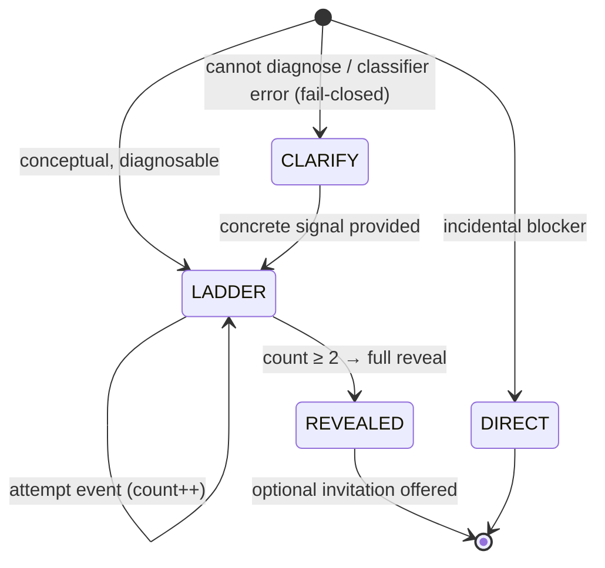

# Attempt Evidence — Definition + Exemplar Transcripts

**Status:** Revision 6 — MVP state model aligned with approved RFC review decisions. Resolves RFC-001 §7.2 under unblock-first. The response policy lives in the teaching prompt; attempt counting, new-problem reset, and pacing live in extension state. **No numbered ladder levels** — DIRECT/LADDER/CLARIFY only.

## Definition

An **attempt event** is a learner turn containing at least one of these signals. **Events are counted per turn, not per signal** — a single turn showing changed code _and_ describing what happened is one event, so one edit cannot farm two credits.

| Signal                         | Example                                                               |
| ------------------------------ | --------------------------------------------------------------------- |
| **A1. Described action**       | "I tried moving the return outside the loop and it still prints once" |
| **A2. Stated prediction**      | "I expected `range(5)` to include 5"                                  |
| **A3. Changed code presented** | Pastes a revision differing from the earlier version                  |
| **A4. Explicit reasoning**     | "I think the bug is in the loop condition because it exits early"     |

**Not an attempt event:** re-asking, rewording, frustration without what/how, asking for the answer, pasting unchanged code. These earn no ladder advancement; where they also leave the blocker undiagnosable, the response is **CLARIFY** — one concrete prompt for a signal.

## MVP response policy (complete)

| Mode        | When                                                                                                                                                   | Behavior                                                                                                                                                                                                                                             |
| ----------- | ------------------------------------------------------------------------------------------------------------------------------------------------------ | ---------------------------------------------------------------------------------------------------------------------------------------------------------------------------------------------------------------------------------------------------- |
| **DIRECT**  | Blocker is incidental _relative to the current learning objective_ (API-name slip, typo, tooling friction that isn't what the learner is practicing)   | Answer immediately, no gating                                                                                                                                                                                                                        |
| **LADDER**  | Conceptual blocker with enough context to diagnose (may start at zero attempt events — a pasted snippet plus a clear symptom is diagnosable, as in T1) | Reveal progressively: each new attempt event earns a more specific step (question → concept → located hint). **Full reveal after two substantive attempt events on the current blocker** (events on an earlier, different blocker do not carry over) |
| **CLARIFY** | **Insufficient context to diagnose or route** (regardless of attempt evidence)                                                                         | Ask for one concrete signal; do not advance                                                                                                                                                                                                          |

**Explain-back:** after a full reveal, the tutor offers one optional invitation to explain why the fix works. It does not gate the answer and triggers no follow-up when ignored. Voluntary engagement is a measured pilot outcome.

**Anti-farming stance:** two substantive events can be performed to farm a reveal — but performing them requires stating predictions or showing changed code, which _is_ engagement. Unblock-first accepts this residual risk; the mitigation is opt-in pilot transcript review plus an optional explain-back invitation, not withholding.

## Exemplar transcripts (attempt events marked ▲)

### T1 — Conceptual, clean progression to full reveal

> **L:** My loop skips the last item. `for (let i = 0; i < items.length - 1; i++) console.log(items[i]);`
> **T:** If `items.length` is 3, for which values of `i` is `i < items.length - 1` true? _(LADDER: orienting question)_
> **L:** 0,1,2? Oh wait — `items.length - 1` is 2, so `i < 2` stops after 1. ▲(A2)
> **T:** Right. A strict less-than bound excludes the bound itself. What upper bound would include index 2? _(LADDER: concept, no fix — one event so far)_
> **L:** I changed it to `i < items.length` and it works. But why did the example I copied have the -1? ▲(A3+A1 = one event; two total)
> **T:** _(full reveal permitted — two substantive events)_ Full explanation of the off-by-one and where a `-1` pattern legitimately appears. Then, once: if useful, tell me why your original version skipped the last item.

### T2 — Incidental _(context: learner's objective is loop logic, not API recall)_

> **L:** Why does `items.append(4)` say `items.append is not a function`?
> **T:** JavaScript arrays use `.push()`: `items.push(4)`. _(DIRECT — API recall is not today's objective. If the objective were the JavaScript collections API, this becomes LADDER.)_

### T3 — No evidence, CLARIFY loop

> **L:** My code doesn't work.
> **T:** What does it do, and what did you expect? Paste the part you suspect. _(CLARIFY)_
> **L:** It just doesn't work. Give me the fix.
> **T:** I can't see the problem yet. Tell me one thing you tried, or what you expected line X to do. _(CLARIFY — no advancement)_

### T4 — Farming attempt, held correctly

> **L:** I tried stuff. It's broken. Just show me the working version.
> **T:** "Tried stuff" — which change specifically? One sentence. _(no event; CLARIFY)_
> **L:** I changed the while condition to `<=` and now it loops forever. ▲(A1+A3 = one event)
> **T:** _(LADDER step, not full reveal — one event)_ That tells us something — what does the condition need to become false? …

### T5 — Uncertainty + escalation

> **L:** _(pastes async race condition beyond model competence)_
> **T:** I'm not confident of the cause here — this looks like a timing issue my analysis may get wrong. Worth taking to your mentor; here's what to show them: … _(uncertainty admission; no confident fabrication)_

## MVP extension state model

The MVP extension replaces "the model counts events from history" with explicit, extension-owned state. The existing hidden pre-pass also returns `new_problem`. A clearly different problem resets state before the current turn is counted; ambiguity preserves state. Pi's native `/new` is the manual override and always starts fresh state. This is conservative new-problem detection, not a blocker taxonomy, blocker ID, or topic-tracking subsystem.

| State field     | Type                        | Semantics                            |
| --------------- | --------------------------- | ------------------------------------ |
| `attempt_count` | int                         | Attempt events observed this session |
| `mode`          | DIRECT \| LADDER \| CLARIFY | Current routing decision             |
| `revealed`      | bool                        | Full reveal delivered                |

**Two-pass mechanics (spike-verified foundation — see `spikes/two-pass-extension/`):** on each accepted idle learner turn, the production extension makes a **hidden pre-response classification call** (same local server, non-streamed, never shown to the learner) that judges routing mode, attempt evidence, and whether the turn is clearly a new problem. The extension **schema-validates** the verdict, resets when `new_problem` is true, and then updates state; any invalid output, timeout, or server error **fails closed to CLARIFY with no count increment or reset**. The validated state is injected into the real request as an authoritative pacing instruction, so the reveal decision exists before generation. One verdict governs all provider retries.

The mechanism spike validates one classification for a normal turn, reuse across one simulated provider retry, fail-closed malformed/stalled responses, and classifier-payload non-persistence. It does **not** implement `new_problem`, reset behavior, or the final mid-stream input guard. Those remain implementation acceptance cases; check-2 cases and pilot review measure real reset errors. This mechanism governs state transitions but does not guarantee response content or perfect new-problem detection.

After each turn, the extension appends `{mode, attempt_event, attempt_count, new_problem}` as a native pi custom session entry. The entry remains local, is not sent to the model, and is preserved directly in an explicitly opted-in JSONL export. Hidden classifier prompts and raw classifier responses do not persist. This lets reviewers distinguish a routing/reset error from a response that ignored correct pacing state. HTML remains useful for reading the conversation but is not the routing-audit format.

**Status display is qualitative, not numeric** — "tell me what you tried and I can help more specifically" — communicating why the tutor asks for engagement without exposing a progress meter to optimize against.

**Prompt-only fallback:** one config flag disables the extension (diagnostic aid). It _enables_ an extension-vs-prompt-only comparison, but a valid comparison requires explicit design — assignment, outcome measures, contamination control — in the pilot protocol; the flag alone is not an experiment.

State machine:

A clearly new problem or native `/new` resets the three state fields before this per-blocker state machine starts again. Ambiguous turns do not reset.

## What this replaces

The formerly-open "define evidence of attempt precisely enough to implement" question in RFC-001 §7. The event definition and three response modes are implemented by the MVP extension's two-pass design above; the teaching prompt carries the behavioral contract, the extension carries the state.
